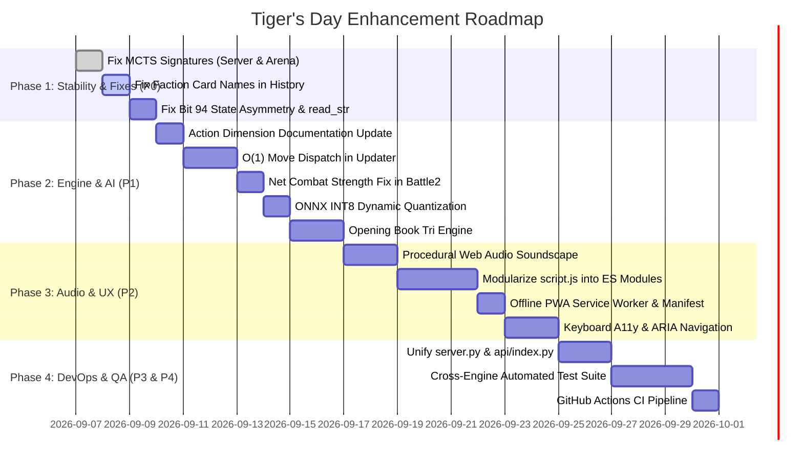

# 🐅 Tiger’s Day — Comprehensive Codebase Audit & Future Improvements Roadmap

This document provides a systematic architectural audit of the **Tiger’s Day (Anglo-Mysore Wars 1767–1799)** repository, cataloging discovered bugs, inconsistencies, performance bottlenecks, and a prioritized feature roadmap for future enhancements.

---

## 📑 Table of Contents

1. [Executive Summary & Health Status](#1-executive-summary--health-status)
2. [Priority Classification Matrix](#2-priority-classification-matrix)
3. [P0 — Critical Bugs & Interface Discrepancies](#3-p0--critical-bugs--interface-discrepancies)
   - [3.1 MCTS Method Signatures Divergence (Server & Arena Crashes)](#31-mcts-method-signatures-divergence-server--arena-crashes)
   - [3.2 Swapped Faction Card Names in Live Moves History](#32-swapped-faction-card-names-in-live-moves-history)
   - [3.3 State Vector Bit 94 Initialization Asymmetry](#33-state-vector-bit-94-initialization-asymmetry)
   - [3.4 Flawed Consecutive Bit Validation in `read_str`](#34-flawed-consecutive-bit-validation-in-read_str)
4. [P1 — Game Engine & AI Pipeline Enhancements](#4-p1--game-engine--ai-pipeline-enhancements)
   - [4.1 Action Space Dimension Reconciliation (953 vs 959)](#41-action-space-dimension-reconciliation-953-vs-959)
   - [4.2 `get_next_state` O(1) Action Table Indexing](#42-get_next_state-o1-action-table-indexing)
   - [4.3 Net Card Strength Application in Secondary Combat Rollouts](#43-net-card-strength-application-in-secondary-combat-rollouts)
   - [4.4 Draw & Repetition Detection Mechanics](#44-draw--repetition-detection-mechanics)
   - [4.5 Heatmap Dependencies & Multiprocessing CUDA Memory Safeguards](#45-heatmap-dependencies--multiprocessing-cuda-memory-safeguards)
   - [4.6 ONNX INT8 Dynamic Quantization](#46-onnx-int8-dynamic-quantization)
   - [4.7 Opening Book Engine & Transposition Table](#47-opening-book-engine--transposition-table)
5. [P2 — Frontend & UX Immersion](#5-p2--frontend--ux-immersion)
   - [4.1 Web Audio API / Atmospheric Soundscape & Sound Effects](#51-web-audio-api--atmospheric-soundscape--sound-effects)
   - [5.2 Modularization of Monolithic `public/script.js`](#52-modularization-of-monolithic-publicscriptjs)
   - [5.3 Dual-Engine Toggle (Client WASM vs Serverless FastAPI)](#53-dual-engine-toggle-client-wasm-vs-serverless-fastapi)
   - [5.4 Progressive Web App (PWA) Offline Installation](#54-progressive-web-app-pwa-offline-installation)
   - [5.5 Keyboard Navigation & Full A11y / Screen Reader Support](#55-keyboard-navigation--full-a11y--screen-reader-support)
   - [5.6 WebRTC Signaling & Reconnection Resilience](#56-webrtc-signaling--reconnection-resilience)
6. [P3 — Server, API & Architecture Hygiene](#6-p3--server-api--architecture-hygiene)
   - [6.1 Unify `server.py` and `api/index.py`](#61-unify-serverpy-and-apiindexpy)
   - [6.2 Server-Side Evaluation Tree LRU Cache & Thread Safety](#62-server-side-evaluation-tree-lru-cache--thread-safety)
   - [6.3 API Rate Limiting, Input Validation & Security](#63-api-rate-limiting-input-validation--security)
7. [P4 — Quality Assurance, CI/CD & DevOps](#7-p4--quality-assurance-cicd--devops)
   - [7.1 Automated Cross-Engine Parity Test Suite (PyTest + Jest)](#71-automated-cross-engine-parity-test-suite-pytest--jest)
   - [7.2 Dependency Pinning Synchronization](#72-dependency-pinning-synchronization)
   - [7.3 GitHub Actions CI/CD Pipeline](#73-github-actions-cicd-pipeline)
   - [7.4 Repository Cleanliness & Artifact Tracking](#74-repository-cleanliness--artifact-tracking)
8. [Phased Implementation Roadmap](#8-phased-implementation-roadmap)

---

## 1. Executive Summary & Health Status

Tiger's Day is a high-caliber hybrid wargaming system combining historical simulation, deep reinforcement learning (AlphaZero + MCTS), 100% client-side WebAssembly ONNX inference, and WebRTC peer-to-peer multiplayer.

During the repository-wide audit, several outstanding achievements were noted:
- The dual-engine architecture (Python NumPy + JavaScript Uint8Array) achieves identical legal move generation across starting board positions.
- The 10 historical themes and 5 modular unit styles provide rich, aesthetic immersion with zero layout letterboxing.
- The ONNX WebAssembly client runs inference at zero server cost.

However, several critical inconsistencies exist:
- Python `MCTS` class signatures diverged from the callers in `server.py`, `api/index.py`, and `ai/arena.py`, resulting in immediate `TypeError` exceptions whenever server-side AI moves or tournament evaluations are invoked.
- Faction card titles in JavaScript history notation are swapped and mislabeled.
- Python and JavaScript game states exhibit an asymmetry in vector bit 94 (combat strength one-hot vector) upon initialization.
- The repository currently has **zero automated tests** and **no CI/CD pipeline**.

---

## 2. Priority Classification Matrix

| Tier | Priority | Category | Impact | Estimated Effort |
|---|---|---|---|---|
| **P0** | Critical | Bug Fixes | Server AI crashes, incorrect history notation, state vector asymmetry | 1–2 Days |
| **P1** | High | Engine & AI | Action dimension alignment, O(1) move lookup, battle strength logic, model quantization | 3–5 Days |
| **P2** | High | Frontend & UX | Web Audio atmospheric soundscape, script modularization, offline PWA, a11y | 4–6 Days |
| **P3** | Medium | Server & API | Unification of `server.py` / `api/index.py`, LRU evaluation cache, security guards | 2–3 Days |
| **P4** | Medium | QA & DevOps | Cross-engine parity test suite, GitHub Actions CI/CD, dependency pinning | 2–3 Days |

---

## 3. P0 — Critical Bugs & Interface Discrepancies

### 3.1 MCTS Method Signatures Divergence (Server & Arena Crashes)
- **Location:** [`ai/mcts.py`](file:///Users/kshitij.tomar/Desktop/Berkeley/TigersDay/ai/mcts.py), [`server.py`](file:///Users/kshitij.tomar/Desktop/Berkeley/TigersDay/server.py), [`api/index.py`](file:///Users/kshitij.tomar/Desktop/Berkeley/TigersDay/api/index.py), [`ai/arena.py`](file:///Users/kshitij.tomar/Desktop/Berkeley/TigersDay/ai/arena.py)
- **Root Cause:**
  - `ai/mcts.py` defines `__init__(self, model, ipuct=800, dalpha=0.5, depsilon=0.25)`. It does **not** accept `simulations`.
  - In `server.py` (lines 62, 200), `api/index.py` (lines 76, 173), and `ai/arena.py` (lines 48, 49), callers instantiate `MCTS(..., simulations=..., ...)`. This raises `TypeError: MCTS.__init__() got an unexpected keyword argument 'simulations'`.
  - `ai/mcts.py` defines `find_move(self, state, simulations, temperature=0.0)`. In `server.py` (line 63) and `api/index.py` (line 77), callers invoke `mcts.find_move(state)` with only one argument, raising `TypeError: missing 1 required positional argument: 'simulations'`. In `ai/arena.py` (lines 69, 70), `find_move(state, temperature)` binds `temperature` (0.0 or 1.0) to `simulations`, running 0 or 1 rollout.
  - In `server.py` (line 210) and `api/index.py` (line 174), callers invoke `mcts.search(state, stop=False)`, but `search` in `ai/mcts.py` only takes `(self, root_state, simulations)` without `stop`.
- **Remediation:**
  1. Update `MCTS.__init__` in `ai/mcts.py` to accept and store `simulations: int = DEFAULT_SIMS`.
  2. Allow `simulations` in `find_move` and `search` to default to `self.simulations`.
  3. Support optional early-stopping parameter `stop: bool = True` in `search` matching the JavaScript engine in `public/js/mcts.js`.

---

### 3.2 Swapped Faction Card Names in Live Moves History
- **Location:** [`public/script.js`](file:///Users/kshitij.tomar/Desktop/Berkeley/TigersDay/public/script.js#L1929-L1934)
- **Root Cause:**
  Lines 1929–1934 define:
  ```javascript
  const BRITISH_CARD_NAMES = [
    "Iron Rockets", "Wall Breach", "Sepoy Mutiny", "French Help", "Maratha Alliance", "Chitaldoorg Defection"
  ];
  const MYSORE_CARD_NAMES = [
    "Royal Navy", "Highlanders", "Force March", "Sea Trade", "Diplomatic Mission", "Cavalry Raid"
  ];
  ```
  Faction cards are completely inverted and feature non-existent card titles ("Maratha Alliance", "Chitaldoorg Defection", "Diplomatic Mission").
- **Remediation:**
  Realign strictly with `game/constants.py`:
  ```javascript
  const MYSORE_CARD_NAMES = [
    "Iron Rockets", "Sepoy Mutiny", "French Alliance", "Monsoon", "Cavalry Raid", "Sea Trade"
  ];
  const BRITISH_CARD_NAMES = [
    "Wall Breach", "Highlanders", "Royal Navy", "Divide and Rule", "Force March", "Princely States"
  ];
  ```

---

### 3.3 State Vector Bit 94 Initialization Asymmetry
- **Location:** [`game/state.py`](file:///Users/kshitij.tomar/Desktop/Berkeley/TigersDay/game/state.py#L26-L35), [`public/js/state.js`](file:///Users/kshitij.tomar/Desktop/Berkeley/TigersDay/public/js/state.js#L162)
- **Root Cause:**
  - In Python `game/state.py`, `__init__` sets `self._card_strength = 0` but leaves `self.vector` all zeros at indices 94–97 (`IDX_COMBAT_STRENGTH`).
  - In JavaScript `public/js/state.js`, `constructor()` sets `this.card_strength = 0;`, which sets bit 94 to `1` (one-hot encoding for 0 strength).
  - When a battle resolves in Python, `clear_battle()` sets `self.card_strength = 0`, setting bit 94 to `True`.
  - As a result, starting state strings differ at index 94 between Python (`0`) and JS (`1`).
- **Remediation:**
  Explicitly call `self.card_strength = 0` during Python `GameState.__init__()` and `default_setup()` so bit 94 is consistently initialized to `True` in both runtimes.

---

### 3.4 Flawed Consecutive Bit Validation in `read_str`
- **Location:** [`game/state.py`](file:///Users/kshitij.tomar/Desktop/Berkeley/TigersDay/game/state.py#L201-L209)
- **Root Cause:**
  ```python
  try:
      for i in range(12, 136):
          if all(new_state.vector[i : i+3]):
              t_idx = (i - 12) // 3
              name = INDEX_MAP[t_idx] if t_idx in INDEX_MAP else f"Bit {i}"
              raise ValueError(f"Invalid Binary: Triple consecutive 1s detected starting at {name}")
  except ValueError:
      raise ValueError(f"Invalid Binary: Triple consecutive 1s detected starting at {name}")
  ```
  1. Territory nodes span indices 12 to 87 (`12 + 25 * 3`). Iterating up to 136 checks across unrelated turn, player, combat, and attacker/defender bit fields.
  2. Iterating with step 1 checks across territory boundaries.
  3. If another `ValueError` occurs before `name` is assigned, accessing `name` in the `except` block throws `UnboundLocalError`.
  4. The rule invariant should check that **no node has more than one unit** (i.e., `np.sum(new_state.vector[i : i+3]) > 1`).
- **Remediation:**
  Refactor validation to:
  ```python
  for node_idx in range(NODES):
      start = self.IDX_NODES_OFFSET + node_idx * 3
      if np.sum(new_state.vector[start : start + 3]) > 1:
          raise ValueError(f"Invalid Binary: Multiple units assigned to territory {INDEX_MAP[node_idx]}")
  ```

---

## 4. P1 — Game Engine & AI Pipeline Enhancements

### 4.1 Action Space Dimension Reconciliation (953 vs 959)
- **Location:** [`README.md`](file:///Users/kshitij.tomar/Desktop/Berkeley/TigersDay/README.md), [`game/constants.py`](file:///Users/kshitij.tomar/Desktop/Berkeley/TigersDay/game/constants.py), [`public/js/state.js`](file:///Users/kshitij.tomar/Desktop/Berkeley/TigersDay/public/js/state.js#L113)
- **Detail:**
  The graph has **25 territories** and **86 directed edges** (43 bidirectional connections, including Poona-Bombay, Poona-Hyderabad, and Poona-Satara). In `MOVE_SPACE`, `Move`, `Divide and Rule`, and `Force March` each consume `EDGES` entries.
  $3 \times 86 = 258$, bringing the action space to **959**, matching the exported ONNX model (`(1, 959)`).
- **Task:**
  Update references in `README.md`, code comments in `state.js`, and documentation from 953 to 959.

---

### 4.2 `get_next_state` O(1) Action Table Indexing
- **Location:** [`game/updater.py`](file:///Users/kshitij.tomar/Desktop/Berkeley/TigersDay/game/updater.py#L13-L20), [`public/js/engine.js`](file:///Users/kshitij.tomar/Desktop/Berkeley/TigersDay/public/js/engine.js#L260-L280)
- **Detail:**
  `get_next_state` currently scans `MOVE_SPACE` sequentially with `offset <= move < offset + size` for every transition. Over 800 MCTS simulations $\times$ 40 moves per game, this linear scan executes millions of times.
- **Task:**
  Precompute a dispatch lookup table `ACTION_DISPATCH = [None] * MOVE_VECTOR_LENGTH` at module load time storing `(handler_fn, local_idx)`. This converts move resolution from $O(K)$ linear range tests to $O(1)$ direct array dispatch.

---

### 4.3 Net Card Strength Application in Secondary Combat Rollouts
- **Location:** [`game/updater.py`](file:///Users/kshitij.tomar/Desktop/Berkeley/TigersDay/game/updater.py#L67-L74,L123,L167)
- **Detail:**
  In `Force March` and `Royal Navy`, `resolve_battles(state, attacker, defender, -state.card_strength)` passes net card strength, but inside `resolve_battles`:
  ```python
  if attacker != NO_UNIT:
      battle2 = is_battle_won(state, defender, 0)
  ```
  `battle2` hardcodes `0` strength instead of honoring the passed `net_card_strength` parameter, ignoring Mysore tactical cards played earlier in that phase.
- **Task:**
  Pass `net_card_strength` into `battle2` resolution.

---

### 4.4 Draw & Repetition Detection Mechanics
- **Location:** [`game/updater.py`](file:///Users/kshitij.tomar/Desktop/Berkeley/TigersDay/game/updater.py#L142-L148), [`public/js/engine.js`](file:///Users/kshitij.tomar/Desktop/Berkeley/TigersDay/public/js/engine.js)
- **Detail:**
  Currently, game termination only checks:
  1. British occupies all 5 Key Cities $\rightarrow$ `+1`
  2. Turn 4 completes with no fresh armies remaining $\rightarrow$ `-1`
  There is no threefold repetition or stalemate check. If British moves armies back and forth without attacking, games can cycle indefinitely in self-play or arena loops.
- **Task:**
  Implement a history transposition hash set checking for threefold repetition or an impulse turn cap per war season.

---

### 4.5 Heatmap Dependencies & Multiprocessing CUDA Memory Safeguards
- **Location:** [`ai/heatmap.py`](file:///Users/kshitij.tomar/Desktop/Berkeley/TigersDay/ai/heatmap.py), [`ai/multitrain.py`](file:///Users/kshitij.tomar/Desktop/Berkeley/TigersDay/ai/multitrain.py), [`requirements-dev.txt`](file:///Users/kshitij.tomar/Desktop/Berkeley/TigersDay/requirements-dev.txt)
- **Detail:**
  - `ai/heatmap.py` imports `matplotlib.pyplot` and `seaborn`, which are missing from `requirements.txt` and `requirements-dev.txt`.
  - In `ai/multitrain.py`, passing a CUDA model directly into a `ProcessPoolExecutor` with `ctx = mp.get_context("spawn")` causes CUDA reinitialization faults on GPU servers unless workers keep local CPU copies and aggregate gradients via `torch.multiprocessing.Queue`.
- **Task:**
  - Add `matplotlib` and `seaborn` to `requirements-dev.txt`.
  - Implement worker-safe CPU inference copies or batch inference servers in `ai/multitrain.py`.

---

### 4.6 ONNX INT8 Dynamic Quantization
- **Location:** [`ai/onnx.py`](file:///Users/kshitij.tomar/Desktop/Berkeley/TigersDay/ai/onnx.py)
- **Detail:**
  `public/alphatiger.onnx` currently weighs 1.6 MB with Float32 weights.
- **Task:**
  Add an export script utility using `onnxruntime.quantization.quantize_dynamic` to produce `alphatiger.quant.onnx`. This reduces asset weight by ~70% (down to ~420 KB) and accelerates browser SIMD WASM execution on mobile devices.

---

### 4.7 Opening Book Engine & Transposition Table
- **Location:** [`ai/mcts.py`](file:///Users/kshitij.tomar/Desktop/Berkeley/TigersDay/ai/mcts.py), [`public/js/mcts.js`](file:///Users/kshitij.tomar/Desktop/Berkeley/TigersDay/public/js/mcts.js)
- **Detail:**
  Opening moves (e.g. `trv>alw`, `mad>pdc`, `bom>sat`) are repeatedly solved via raw MCTS rollouts at the start of every game.
- **Task:**
  Use existing self-play databases (`replay_log.txt`, 200+ games) to synthesize an opening book JSON trie. For the first 3 plies, the engine can play book moves instantly with 0ms latency.

---

## 5. P2 — Frontend & UX Immersion

### 5.1 Web Audio API / Atmospheric Soundscape & Sound Effects
- **Location:** New module [`public/js/sound.js`](file:///Users/kshitij.tomar/Desktop/Berkeley/TigersDay/public/js/)
- **Detail:**
  The game currently features zero audio feedback. Adding procedural Web Audio sound synthesis (zero external audio file dependencies) or lightweight sound bites will dramatically heighten immersion:
  - **Troop March:** Rhythmic military snare drum / boots on turf.
  - **Siege Clash:** Cannon fire rumble and clashing swords upon initiating combat.
  - **Card Activation:** Crisp parchment flap and wax seal snap.
  - **Luck Discard:** Dice rattle / flintlock misfire.
  - **Victory:** Fanfare fanfare for British triumph or regal Mysore nagara drums.
  - **Settings:** Audio toggle with master volume slider.

---

### 5.2 Modularization of Monolithic `public/script.js`
- **Location:** [`public/script.js`](file:///Users/kshitij.tomar/Desktop/Berkeley/TigersDay/public/script.js) (2,967 lines)
- **Detail:**
  `script.js` contains SVG map geometry, 12 vector card illustrations, theme definitions, token renderers, point-and-click state machines, MCTS coordinator, live history notation, and settings modal controls in a single 122 KB file.
- **Task:**
  Decompose into clean, decoupled ES modules:
  - `public/js/ui/map-view.js`: SVG board, edges, nodes, animations, and battle markers.
  - `public/js/ui/card-view.js`: Card SVG templates and wax seal click handlers.
  - `public/js/ui/themes.js`: 10 palette definitions and token styles.
  - `public/js/ui/history-view.js`: Algebraic move stepper and notation feed.
  - `public/js/ui/controller.js`: Main event orchestrator.

---

### 5.3 Dual-Engine Toggle (Client WASM vs Serverless FastAPI)
- **Location:** [`public/script.js`](file:///Users/kshitij.tomar/Desktop/Berkeley/TigersDay/public/script.js), [`public/index.html`](file:///Users/kshitij.tomar/Desktop/Berkeley/TigersDay/public/index.html)
- **Detail:**
  Currently, client-side inference runs exclusively in the browser. Players on older mobile phones or battery-saver mode may experience frame drops during 800+ MCTS simulations.
- **Task:**
  Add an engine selector in the Settings modal:
  - `Client-Side WASM (Offline / Instant)`
  - `Server API (Cloud GPU / Serverless FastAPI)`
  When set to Server API, AI moves and evaluation bar requests route through `/api/play-ai` and `/api/eval-step`.

---

### 5.4 Progressive Web App (PWA) Offline Installation
- **Location:** New files `public/manifest.json`, `public/sw.js`
- **Detail:**
  Tiger's Day runs completely offline with WebAssembly and local storage.
- **Task:**
  - Register a Service Worker caching `alphatiger.onnx`, `index.html`, `style.css`, fonts, and scripts.
  - Add a Web App Manifest with icons so users can install Tiger's Day as a standalone desktop or iPad wargaming application.

---

### 5.5 Keyboard Navigation & Full A11y / Screen Reader Support
- **Location:** [`public/index.html`](file:///Users/kshitij.tomar/Desktop/Berkeley/TigersDay/public/index.html), [`public/script.js`](file:///Users/kshitij.tomar/Desktop/Berkeley/TigersDay/public/script.js)
- **Detail:**
  Map nodes are SVG `<g>` elements that lack keyboard focus (`tabindex="0"`) and ARIA roles.
- **Task:**
  - Add `tabindex="0"`, `role="button"`, and `aria-label="Node Name, Occupied by Fresh Army"` to all SVG nodes.
  - Support arrow-key map navigation and hotkeys (`Space` to select, `R` to Rest, `P` to Pass, `Z` to Undo / Step Back).

---

### 5.6 WebRTC Signaling & Reconnection Resilience
- **Location:** [`public/js/multiplayer.js`](file:///Users/kshitij.tomar/Desktop/Berkeley/TigersDay/public/js/multiplayer.js)
- **Detail:**
  P2P multiplayer currently relies solely on public PeerJS cloud brokers without heartbeat reconnects or fallback room recovery if a player briefly switches mobile tabs.
- **Task:**
  - Add a 5-second heartbeat ping/pong.
  - Implement auto-reconnect logic that resynchronizes the game state vector upon reconnection without resetting the match.

---

## 6. P3 — Server, API & Architecture Hygiene

### 6.1 Unify `server.py` and `api/index.py`
- **Location:** [`server.py`](file:///Users/kshitij.tomar/Desktop/Berkeley/TigersDay/server.py), [`api/index.py`](file:///Users/kshitij.tomar/Desktop/Berkeley/TigersDay/api/index.py)
- **Detail:**
  Both files implement near-identical FastAPI endpoints (`/api/init`, `/api/load-state`, `/api/play-move`, `/api/play-ai`, `/api/eval-step`, `/api/get-notation`), with minor divergent bug fixes in `api/index.py` for Vercel.
- **Task:**
  Refactor into a single clean application factory `api/app.py` imported by both `api/index.py` (serverless entrypoint) and `server.py` (local Uvicorn CLI entrypoint).

---

### 6.2 Server-Side Evaluation Tree LRU Cache & Thread Safety
- **Location:** [`server.py`](file:///Users/kshitij.tomar/Desktop/Berkeley/TigersDay/server.py#L182-L208)
- **Detail:**
  `active_eval_trees` is a naked global dictionary holding reference to MCTS search trees. In concurrent multi-user environments, this dictionary can grow without bounds and suffers from race conditions.
- **Task:**
  Wrap tree caching with `collections.OrderedDict` or an LRU cache with a maximum capacity of 32 states and an `asyncio.Lock()`.

---

### 6.3 API Rate Limiting, Input Validation & Security
- **Location:** [`api/index.py`](file:///Users/kshitij.tomar/Desktop/Berkeley/TigersDay/api/index.py)
- **Detail:**
  Endpoints accept `state_str` without verifying length or character set in Pydantic schema before parsing, allowing potential memory exhaustion from unbounded requests.
- **Task:**
  Use Pydantic `constr(regex="^[01]{148}$")` to reject invalid bit strings before execution.

---

## 7. P4 — Quality Assurance, CI/CD & DevOps

### 7.1 Automated Cross-Engine Parity Test Suite (PyTest + Jest)
- **Location:** New directories `tests/python/` and `tests/js/`
- **Detail:**
  Currently, there are **no automated test files** in the repository.
- **Task:**
  Create automated parity tests:
  1. **Rule Parity Tests:** Run 100 identical seed games through both Python `game/updater.py` and JS `public/js/engine.js`, asserting byte-for-byte state vector equivalence after every move.
  2. **Move Generator Tests:** Verify legal move masks match across all edge cases (Sepoy Mutiny on Key City, French Alliance fort adjacency, Royal Navy coastal restrictions).
  3. **Inference Consistency:** Assert that PyTorch model output and exported ONNX model output match within $\epsilon < 10^{-4}$ tolerance.

---

### 7.2 Dependency Pinning Synchronization
- **Location:** [`requirements.txt`](file:///Users/kshitij.tomar/Desktop/Berkeley/TigersDay/requirements.txt), [`requirements-dev.txt`](file:///Users/kshitij.tomar/Desktop/Berkeley/TigersDay/requirements-dev.txt)
- **Detail:**
  `requirements.txt` specifies `numpy>=1.24.0,<2.0.0`, whereas `requirements-dev.txt` installs `numpy==2.4.3`.
- **Task:**
  Align NumPy 2.x support across both dependency manifests, verifying PyTorch and ONNX Runtime wheels compatibility.

---

### 7.3 GitHub Actions CI/CD Pipeline
- **Location:** New directory `.github/workflows/`
- **Task:**
  Add `.github/workflows/ci.yml` running on every pull request:
  - **Python CI:** Run `pytest`, `flake8` / `ruff`, and state validation.
  - **JavaScript CI:** Run `node --test` or `jest` for client engine verification.
  - **Build Check:** Verify ONNX model integrity and static asset compression.

---

### 7.4 Repository Cleanliness & Artifact Tracking
- **Location:** Root directory
- **Detail:**
  Root contains large ephemeral files:
  - `arena_log.txt` (3.0 MB)
  - `replay_log.txt` (80 KB)
  - `:memory:.ses` (session scratch file)
- **Task:**
  Move logs to a dedicated `logs/` directory and ensure `.gitignore` excludes `.ses` and generated arena output.

---

## 8. Phased Implementation Roadmap



---

*Authored following exhaustive repository analysis on 2026-09-06.*
