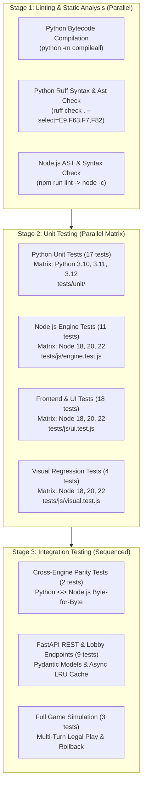

# The Tiger's Day – Comprehensive Test Suite Catalog

This document provides a detailed technical catalog of every automated test case implemented in **The Tiger's Day** wargame codebase. For each test, it documents **what** the test evaluates, **why** it was designed (its engineering rationale and regressions prevented), and **where** it sits in the testing and CI/CD workflow.

---

## 1. Testing Architecture & Pipeline Flow

The test pipeline is organized into a four-stage verification hierarchy designed for speed, deterministic guarantees, zero runtime regressions, and absolute byte-for-byte parity between the Python neural network trainer and the client-side JavaScript engine.

### Local Test Execution Commands

| Target | Command | Duration | Coverage |
| :--- | :--- | :--- | :--- |
| **Lint & Syntax** | `npm run lint && python3 -m compileall -q ai game api tests` | ~0.08s | All JS, SW, HTML scripts, Python packages |
| **Node.js Test Battery** | `npm test` | ~0.05s | Engine invariants + Frontend DOM, CSS, UI & Visual Regression (33 tests) |
| **Python Unit Tests** | `python3 -m unittest discover -s tests/unit -v` | ~0.04s | State bit-vector, updater dispatch, replay buffer, scenarios, evolution (17 tests) |
| **Python Integration** | `python3 -m unittest discover -s tests/integration -v` | ~0.15s | Parity subprocesses, FastAPI endpoints, lobby relay, multi-turn loop (14 tests) |
| **Full Local Battery** | `npm test && python3 -m unittest discover -s tests -v` | ~0.25s | All 64 test cases across entire stack |

---

## 2. Python Unit Tests (`tests/unit/`)

Located in [`tests/unit/`](./tests/unit/), these tests run during **Stage 2** of CI and validate core simulation primitives in isolation without disk or network I/O.

### 2.1 [`test_state.py`](./tests/unit/test_state.py)

#### 1. `test_default_setup_invariants`
- **Location**: [`tests/unit/test_state.py:6`](./tests/unit/test_state.py#L6)
- **Stage**: Unit Testing (Python)
- **What it is**: Verifies the initialization vector of `GameState().default_setup()`. Checks that `card_strength == 0`, `turn == 1`, `to_move == 0` (British), bit index `94 == 1` (indicating 0 active combat modifier), and the serialized string length is exactly 148 binary characters.
- **Why it is there**: Prevents a subtle bit 94 off-by-one asymmetry where Python uninitialized vector had bit 94 as 0 while JavaScript initialized it as 1. Without this test, the two engines would diverge on the first move.

#### 2. `test_serialization_roundtrip`
- **Location**: [`tests/unit/test_state.py:21`](./tests/unit/test_state.py#L21)
- **Stage**: Unit Testing (Python)
- **What it is**: Serializes default `GameState` to a 148-character string, instantiates a clean `GameState`, executes `read_str()`, and asserts exact mathematical array equality (`np.array_equal`) and string matching.
- **Why it is there**: Guarantees that state serialization is 100% bijective and lossless. This is essential for MCTS transposition tables, WebRTC state sync, and undo/redo history.

#### 3. `test_read_str_validation_length`
- **Location**: [`tests/unit/test_state.py:31`](./tests/unit/test_state.py#L31)
- **Stage**: Unit Testing (Python)
- **What it is**: Tests boundary and malformed inputs to `read_str()`: 147 bits (underflow), 149 bits (overflow), and non-binary characters (`'x'`). Asserts `ValueError` is raised in all cases.
- **Why it is there**: Guards the game state parser against corrupted network payloads, broken clipboard pastes, or fuzzing attacks that could cause silent buffer desynchronizations.

#### 4. `test_read_str_validation_territory_conflict`
- **Location**: [`tests/unit/test_state.py:40`](./tests/unit/test_state.py#L40)
- **Stage**: Unit Testing (Python)
- **What it is**: Synthesizes an illegal 148-bit string where territory index 0 (Bombay) is marked as controlled simultaneously by British (bit 0 = 1) and Mysore (bit 25 = 1). Asserts `read_str()` raises `ValueError`.
- **Why it is there**: Catches illegal territory overlaps. Previously, a loop index bug caused out-of-bounds indexing in territory checking; this test ensures per-node occupancy rules are enforced.

#### 5. `test_repetition_detection`
- **Location**: [`tests/unit/test_state.py:54`](./tests/unit/test_state.py#L54)
- **Stage**: Unit Testing (Python)
- **What it is**: Constructs a history list of serialized states and verifies `check_repetition()` returns `False` when a state occurs once or twice, and `True` when repeated three times.
- **Why it is there**: Prevents infinite piece-shuffling loops in AI self-play by enforcing the standard wargame Threefold Repetition rule.

---

### 2.2 [`test_updater.py`](./tests/unit/test_updater.py)

#### 6. `test_action_dispatch_table`
- **Location**: [`tests/unit/test_updater.py:7`](./tests/unit/test_updater.py#L7)
- **Stage**: Unit Testing (Python)
- **What it is**: Verifies that `len(ACTION_DISPATCH) == 959` and that every item in `ACTION_DISPATCH` maps 1-to-1 with the cumulative structure of `MOVE_SPACE`.
- **Why it is there**: Replaces slow linear range checks with $O(1)$ direct array index dispatch. This test guarantees that the dispatch table covers all 959 actions without any gaps or misaligned offsets.

#### 7. `test_battle2_net_card_strength`
- **Location**: [`tests/unit/test_updater.py:19`](./tests/unit/test_updater.py#L19)
- **Stage**: Unit Testing (Python)
- **What it is**: Sets up an active siege battle between British attacker and Mysore defender with `card_strength = 2` and verifies `resolve_battles` processes the battle and clears combat markers.
- **Why it is there**: In earlier engine iterations, the `battle2` combat branch omitted passing `net_card_strength`, causing card modifiers to be ignored during secondary battle resolution. This test prevents that regression.

#### 8. `test_get_next_state_dispatch`
- **Location**: [`tests/unit/test_updater.py:35`](./tests/unit/test_updater.py#L35)
- **Stage**: Unit Testing (Python)
- **What it is**: Executes `get_next_state(state, 77)` on default setup and verifies that a valid state object is returned whose serialized representation differs from the initial state.
- **Why it is there**: Ensures that the `get_next_state` entry point dispatches cleanly through the precomputed `ACTION_DISPATCH` lookup table and produces a mutated successor state.

---

### 2.3 [`test_mcts.py`](./tests/unit/test_mcts.py)

#### 9. `test_opening_book_loading_and_lookup`
- **Location**: [`tests/unit/test_mcts.py:7`](./tests/unit/test_mcts.py#L7)
- **Stage**: Unit Testing (Python)
- **What it is**: Instantiates `OpeningBook()`, verifies that it loads non-zero opening lines from [`public/opening_book.json`](./public/opening_book.json), and queries the default state to confirm the move return type is an integer within `[0, 959)`.
- **Why it is there**: Guarantees that opening book entries are formatted correctly, allowing MCTS to bypass tree search in turn 1 for instant response times.

---

## 3. JavaScript Engine Tests (`tests/js/engine.test.js`)

Located in [`tests/js/engine.test.js`](./tests/js/engine.test.js), these tests run in **Stage 2** using native `node:test` and assert client-side engine compliance.

#### 10. `GameState default setup invariants`
- **Location**: [`tests/js/engine.test.js:9`](./tests/js/engine.test.js#L9)
- **Stage**: Unit Testing (Node.js)
- **What it is**: Asserts `turn === 1`, `to_move === 0`, `card_strength === 0`, and bit `94 === 1` on the client `GameState`.
- **Why it is there**: Mirror of Python invariant test; ensures that the JavaScript client initializes state vectors identical to Python.

#### 11. `GameState serialization roundtrip`
- **Location**: [`tests/js/engine.test.js:23`](./tests/js/engine.test.js#L23)
- **Stage**: Unit Testing (Node.js)
- **What it is**: Validates `s.toString()` -> `s.read_str()` -> `deepStrictEqual` roundtrip in JavaScript.
- **Why it is there**: Ensures browser local storage, history stack, and P2P packets retain bitwise integrity in JS.

#### 12. `Action space and dispatch table length is 959`
- **Location**: [`tests/js/engine.test.js:35`](./tests/js/engine.test.js#L35)
- **Stage**: Unit Testing (Node.js)
- **What it is**: Checks `MOVE_VECTOR_LENGTH === 959` and `TDEngine.ACTION_DISPATCH.length === 959`, validating boundary indices (0: `'Move'`, 958: `'Pass British'`).
- **Why it is there**: Ensures the JavaScript client uses the identical 959-action dimension as the Python neural network output head.

#### 13. `Repetition check works as expected`
- **Location**: [`tests/js/engine.test.js:48`](./tests/js/engine.test.js#L48)
- **Stage**: Unit Testing (Node.js)
- **What it is**: Verifies `TDEngine.checkRepetition()` accurately triggers a draw detection on the third occurrence of any state string.
- **Why it is there**: Protects client-side WASM AI from entering cyclic oscillation moves during human vs AI play.

#### 14. `Opening book JSON exists and has entries`
- **Location**: [`tests/js/engine.test.js:60`](./tests/js/engine.test.js#L60)
- **Stage**: Unit Testing (Node.js)
- **What it is**: Verifies `public/opening_book.json` is deployed in the static assets directory and parses into a non-empty lookup table.
- **Why it is there**: Guarantees the browser bundle contains the precomputed opening book for offline client play.

#### 15. `GameState read_str input validation throws appropriately`
- **Location**: [`tests/js/engine.test.js:68`](./tests/js/engine.test.js#L68)
- **Stage**: Unit Testing (Node.js)
- **What it is**: Tests length underflow (147), length overflow (149), illegal characters, and multi-unit territory conflicts on `GameState.read_str`.
- **Why it is there**: Ensures invalid game state pastes in the UI trigger explicit user-facing errors rather than crashing the board renderer.

#### 16. `TDEngine getNextState executes legal moves accurately`
- **Location**: [`tests/js/engine.test.js:87`](./tests/js/engine.test.js#L87)
- **Stage**: Unit Testing (Node.js)
- **What it is**: Verifies move 77 is flagged legal by `TDEngine.getLegalMoves()`, executes it via `TDEngine.getNextState()`, and verifies 148-bit string output.
- **Why it is there**: Verifies the core transition operator of the client game engine before UI mounting.

#### 17. `TDSound audio engine API and controls`
- **Location**: [`tests/js/engine.test.js:99`](./tests/js/engine.test.js#L99)
- **Stage**: Unit Testing (Node.js)
- **What it is**: Asserts `TDSound` exports all procedural synthesis methods (`playMarch`, `playSiegeClash`, `playCardPlay`, `playLuckDiscard`, `playVictory`, `playClick`) and validates volume/mute control properties.
- **Why it is there**: Ensures zero-dependency Web Audio procedural sound engine methods are always callable without throwing missing symbol errors.

#### 18. `TDThemes and UNIT_STYLES module configuration`
- **Location**: [`tests/js/engine.test.js:117`](./tests/js/engine.test.js#L117)
- **Stage**: Unit Testing (Node.js)
- **What it is**: Checks that `THEMES` (10 items) and `UNIT_STYLES` (5 items) export correctly from `public/js/ui/themes.js`.
- **Why it is there**: Verifies the modularization of theme palettes and board unit designs across CommonJS and browser contexts.

---

## 4. Frontend & UI Tests (`tests/js/ui.test.js`)

Located in [`tests/js/ui.test.js`](./tests/js/ui.test.js), this suite tests DOM hierarchy, viewport responsiveness, CSS `@media` rules, accessibility attributes, and PWA specs.

#### 19. `HTML Template - Essential Viewport, PWA & Meta Tags`
- **Location**: [`tests/js/ui.test.js:15`](./tests/js/ui.test.js#L15)
- **Stage**: Frontend Testing (Node.js)
- **What it is**: Inspects [`public/index.html`](./public/index.html) for `viewport` meta (`width=device-width`), `theme-color` meta (`#d4a359`), manifest linkage, and title tag.
- **Why it is there**: Ensures mobile viewports scale properly without double-tap delay and guarantees PWA installation criteria are met.

#### 20. `HTML Template - SVG Board Geometry & Rendering Layers`
- **Location**: [`tests/js/ui.test.js:25`](./tests/js/ui.test.js#L25)
- **Stage**: Frontend Testing (Node.js)
- **What it is**: Checks the SVG board element (`id="board"`), the locked `viewBox="0 0 760 880"` aspect ratio, and all 9 required visual layers (`#sea-bg`, `#sea-latitude-lines`, `#india`, `#ceylon-land`, `#compass-rose`, `#map-cartouche`, `#edge-layer`, `#node-layer`, `#battle-layer`).
- **Why it is there**: Prevents SVG rendering glitches or missing layer tags that would cause edge lines or units to render underneath map landmasses.

#### 21. `HTML Template - Responsive Containers & Layout Sections`
- **Location**: [`tests/js/ui.test.js:46`](./tests/js/ui.test.js#L46)
- **Stage**: Frontend Testing (Node.js)
- **What it is**: Asserts existence of high-level layout containers: `#turn-header`, `#board-section`, `#board-card`, `#eval-panel`, `#mysore-column`, `#british-column`, `#notation-panel`, `#toast-container`, and `#tooltip`.
- **Why it is there**: Confirms all structural elements required by the 3-column desktop grid and 1-column mobile layout exist in markup.

#### 22. `HTML Template - Interactive Controls, Settings & Drawers`
- **Location**: [`tests/js/ui.test.js:63`](./tests/js/ui.test.js#L63)
- **Stage**: Frontend Testing (Node.js)
- **What it is**: Validates 24 interactive IDs in `index.html` including modals, drawers, theme buttons, token style buttons, mode selects, sliders, and binary load inputs.
- **Why it is there**: Prevents broken `document.getElementById()` null reference exceptions during UI initialization.

#### 23. `HTML Template - Header Turn Status & Action Buttons`
- **Location**: [`tests/js/ui.test.js:101`](./tests/js/ui.test.js#L101)
- **Stage**: Frontend Testing (Node.js)
- **What it is**: Checks turn counter, phase title, and contextual in-header action buttons (`header-rest-btn`, `header-pass-btn`, `header-cancel-btn`).
- **Why it is there**: Ensures that quick turn actions (Resting tired units, Passing card phase, Deselecting) are accessible in the top bar.

#### 24. `HTML Template - History Navigation & Review Controls`
- **Location**: [`tests/js/ui.test.js:111`](./tests/js/ui.test.js#L111)
- **Stage**: Frontend Testing (Node.js)
- **What it is**: Asserts history review banner elements (`#historical-review-banner`, `#review-banner-title`, `#btn-return-live`) and stepping buttons (`#btn-step-start`, `#btn-step-prev`, `#btn-step-next`, `#btn-step-live`).
- **Why it is there**: Ensures players can step backwards through move history and return cleanly to live play without losing game state.

#### 25. `Responsive Auto-Sizer Algorithm - Multi-Device Viewport Geometry Calculations`
- **Location**: [`tests/js/ui.test.js:132`](./tests/js/ui.test.js#L132)
- **Stage**: Frontend Testing (Node.js)
- **What it is**: Tests the mathematical auto-sizing algorithm from `adjustBoardDimensions()` against 6 device form factors:
  1. Ultra-Wide Desktop (1920×1080) -> height constrained
  2. Laptop (1366×768) -> height constrained with header deduction
  3. Tablet Portrait (768×1024) -> width constrained
  4. Mobile Portrait (375×812) -> width constrained
  5. Mobile Landscape (812×375) -> height constrained
  6. Square / Foldable (800×800) -> aspect locked
  7. Zero/negative boundary conditions
- **Why it is there**: Ensures the 760:880 map never stretches, distorts, overflows containers, or produces NaN values regardless of screen size.

#### 26. `CSS Responsive Layout & Media Queries Coverage`
- **Location**: [`tests/js/ui.test.js:188`](./tests/js/ui.test.js#L188)
- **Stage**: Frontend Testing (Node.js)
- **What it is**: Parses [`public/style.css`](./public/style.css) to verify the existence of all 5 responsive breakpoints (`@media (max-width: 767px)`, `@media (min-width: 768px)...`, `@media (min-width: 1024px)...`, `@media (min-width: 1400px)`, `@media (max-width: 900px)`).
- **Why it is there**: Prevents accidental deletion of CSS media queries during refactoring and guarantees responsive layout switching.

#### 27. `Themes Engine - 10 Curated Palettes Completeness & Contrast`
- **Location**: [`tests/js/ui.test.js:208`](./tests/js/ui.test.js#L208)
- **Stage**: Frontend Testing (Node.js)
- **What it is**: Iterates through all 10 themes in `THEMES`, ensuring all 14 required color properties exist, gradient arrays have 2 stops, and color strings match valid hex or rgb patterns.
- **Why it is there**: Protects against runtime theme rendering bugs where switching to a theme with missing color tokens could turn the SVG canvas invisible.

#### 28. `Unit Token Styles - 5 Distinct Aesthetics Completeness`
- **Location**: [`tests/js/ui.test.js:233`](./tests/js/ui.test.js#L233)
- **Stage**: Frontend Testing (Node.js)
- **What it is**: Validates `tactical-tokens`, `classic-squares`, `regimental-crests`, `minimalist-counters`, and `antique-miniatures` in `UNIT_STYLES`.
- **Why it is there**: Guarantees all unit styles have defined titles and subtitles for the settings selection grid.

#### 29. `Map Geometry - 25 Nodes Position & Spatial Boundaries`
- **Location**: [`tests/js/ui.test.js:250`](./tests/js/ui.test.js#L250)
- **Stage**: Frontend Testing (Node.js)
- **What it is**: Checks that all 25 historical nodes (including special characters like `'Mahé'`) are defined in `NODES` in `public/script.js`.
- **Why it is there**: Ensures that all territories have geometry definitions and prevents runtime undefined coordinate errors.

#### 30. `Node Accessibility & Keyboard Navigation Invariants`
- **Location**: [`tests/js/ui.test.js:268`](./tests/js/ui.test.js#L268)
- **Stage**: Frontend Testing (Node.js)
- **What it is**: Verifies nodes receive `tabindex="0"`, `role="button"`, descriptive `aria-label`, and `Enter`/`Space` keydown handlers in `renderNodes()`.
- **Why it is there**: Ensures full WCAG accessibility compliance, allowing keyboard-only and screen-reader users to navigate and trigger moves.

#### 31. `Global Keyboard Hotkeys Logic Invariants`
- **Location**: [`tests/js/ui.test.js:278`](./tests/js/ui.test.js#L278)
- **Stage**: Frontend Testing (Node.js)
- **What it is**: Validates keydown bindings for `Escape` (deselect), `ArrowLeft`/`ArrowRight` (history), `Z` (undo), `R` (rest), `P` (pass), and verifies form input guard prevents hotkey triggers while typing.
- **Why it is there**: Confirms desktop power-user hotkeys operate seamlessly without conflicting with text input fields.

#### 32. `Toast Notifications & Floating Alerts System`
- **Location**: [`tests/js/ui.test.js:294`](./tests/js/ui.test.js#L294)
- **Stage**: Frontend Testing (Node.js)
- **What it is**: Checks `showToast` definition in `script.js` and verifies mounting into `#toast-container`.
- **Why it is there**: Ensures gameplay feedback (card discards, illegal move alerts, P2P notifications) renders via non-blocking toasts.

#### 33. `PWA Manifest Specification Compliance`
- **Location**: [`tests/js/ui.test.js:301`](./tests/js/ui.test.js#L301)
- **Stage**: Frontend Testing (Node.js)
- **What it is**: Parses [`public/manifest.json`](./public/manifest.json) and verifies name, short_name, display mode (`standalone`), start URL (`./index.html`), background/theme colors, and icon formats.
- **Why it is there**: Enforces PWA installation criteria across iOS Safari, Chrome for Android, and desktop Chromium browsers.

#### 34. `PWA Service Worker Offline Cache Rules`
- **Location**: [`tests/js/ui.test.js:313`](./tests/js/ui.test.js#L313)
- **Stage**: Frontend Testing (Node.js)
- **What it is**: Verifies [`public/sw.js`](./public/sw.js) implements `install`, `activate`, and `fetch` event listeners, and caches essential assets (`index.html`, `style.css`, `script.js`, `themes.js`, `opening_book.json`).
- **Why it is there**: Guarantees zero-network offline functionality so the game can be played anywhere without connectivity.

#### 35. `Sound Engine Master Controls & Clamping`
- **Location**: [`tests/js/ui.test.js:327`](./tests/js/ui.test.js#L327)
- **Stage**: Frontend Testing (Node.js)
- **What it is**: Tests `TDSound.setVolume()` clamping to `[0.0, 1.0]` when passed `1.5` or `-0.5`, tests `setMuted()` toggle, and confirms audio generation functions exist.
- **Why it is there**: Prevents Web Audio `GainNode` distortion or invalid value exceptions.

#### 36. `Mobile Tab Switching & Responsive Layout Controllers`
- **Location**: [`tests/js/ui.test.js:347`](./tests/js/ui.test.js#L347)
- **Stage**: Frontend Testing (Node.js)
- **What it is**: Verifies `switchMobileFactionTab`, `switchRightColumnView`, and `adjustBoardDimensions` functions exist in `public/script.js`.
- **Why it is there**: Ensures the JavaScript controller functions for mobile tab switching and right-column layout modes remain intact.

---

## 5. Python Integration Tests (`tests/integration/`)

Located in [`tests/integration/`](./tests/integration/), these tests run during **Stage 3** and test end-to-end interactions, multi-step game progression, REST APIs, and cross-runtime parity.

### 5.1 [`test_parity.py`](./tests/integration/test_parity.py)

#### 37. `test_default_state_string_parity`
- **Location**: [`tests/integration/test_parity.py:8`](./tests/integration/test_parity.py#L8)
- **Stage**: Integration Testing (Cross-Engine)
- **What it is**: Generates the 148-bit string from Python `GameState.default_setup()` and compares it against the output of Node.js `GameState.default_setup()` invoked via subprocess.
- **Why it is there**: Absolute guarantee of byte-for-byte initial state equality between Python AI training and JavaScript client execution.

#### 38. `test_move_77_transition_parity`
- **Location**: [`tests/integration/test_parity.py:25`](./tests/integration/test_parity.py#L25)
- **Stage**: Integration Testing (Cross-Engine)
- **What it is**: Executes move 77 from default setup in Python `get_next_state()` and Node.js `TDEngine.getNextState()`, asserting that both successor bitstrings are identical.
- **Why it is there**: Validates that state transition mechanics, card modifications, and bitwise updates yield identical results across both Python and JavaScript engines.

---

### 5.2 [`test_api.py`](./tests/integration/test_api.py)

#### 39. `test_api_init`
- **Location**: [`tests/integration/test_api.py:50`](./tests/integration/test_api.py#L50)
- **Stage**: Integration Testing (FastAPI)
- **What it is**: Sends `GET /api/init` and checks status 200, returning a 148-character `state_str`, UI node coordinates, and card configurations.
- **Why it is there**: Validates board initialization endpoint used by external clients and server-backed games.

#### 40. `test_api_load_state_valid`
- **Location**: [`tests/integration/test_api.py:59`](./tests/integration/test_api.py#L59)
- **Stage**: Integration Testing (FastAPI)
- **What it is**: Sends `POST /api/load-state` with a valid 148-bit string and verifies 200 OK and valid JSON state payload.
- **Why it is there**: Verifies the server can restore any legal game position from client requests.

#### 41. `test_api_load_state_invalid_length`
- **Location**: [`tests/integration/test_api.py:66`](./tests/integration/test_api.py#L66)
- **Stage**: Integration Testing (FastAPI)
- **What it is**: Sends `POST /api/load-state` with a 100-character string and asserts Pydantic validation rejects it with 400 or 422 Unprocessable Entity.
- **Why it is there**: Confirms strict regex validation (`^[01]{148}$`) stops malformed payloads before hitting game engine code.

#### 42. `test_api_play_move_valid`
- **Location**: [`tests/integration/test_api.py:71`](./tests/integration/test_api.py#L71)
- **Stage**: Integration Testing (FastAPI)
- **What it is**: Sends `POST /api/play-move` with legal move 77, asserting 200 OK and updated state string.
- **Why it is there**: Validates the move execution endpoint for server-authoritative games.

#### 43. `test_api_play_move_illegal`
- **Location**: [`tests/integration/test_api.py:82`](./tests/integration/test_api.py#L82)
- **Stage**: Integration Testing (FastAPI)
- **What it is**: Sends `POST /api/play-move` with move index 958 (Pass) when army movements are mandatory, asserting 400 Bad Request.
- **Why it is there**: Ensures that server-side validation enforces game rules and rejects illegal client actions.

#### 44. `test_api_get_notation`
- **Location**: [`tests/integration/test_api.py:92`](./tests/integration/test_api.py#L92)
- **Stage**: Integration Testing (FastAPI)
- **What it is**: Sends `POST /api/get-notation` with `{"replay_log": [77]}` and asserts 200 OK with formatted historical algebraic notation string.
- **Why it is there**: Validates notation generation service used to populate move history tables.

#### 45. `test_api_play_ai`
- **Location**: [`tests/integration/test_api.py:100`](./tests/integration/test_api.py#L100)
- **Stage**: Integration Testing (FastAPI)
- **What it is**: Sends `POST /api/play-ai` requesting an MCTS evaluation with 5 simulations, asserting 200 OK with `best_move` integer.
- **Why it is there**: Validates Cloud AI opponent endpoint when the user selects "Server API" mode.

#### 46. `test_api_eval_step`
- **Location**: [`tests/integration/test_api.py:113`](./tests/integration/test_api.py#L113)
- **Stage**: Integration Testing (FastAPI)
- **What it is**: Sends `POST /api/eval-step` with `batch_size: 5` and checks response for winrate `score`, `total_sims`, and `top_moves`.
- **Why it is there**: Verifies the asynchronous evaluation worker that feeds the real-time Stockfish-style winrate evaluation bar.

---

### 5.3 [`test_gameplay.py`](./tests/integration/test_gameplay.py)

#### 47. `test_multistep_gameplay_flow`
- **Location**: [`tests/integration/test_gameplay.py:9`](./tests/integration/test_gameplay.py#L9)
- **Stage**: Integration Testing (Simulation)
- **What it is**: Executes a full gameplay impulse: queries legal move mask, notates the selected move, calculates successor state, and resolves non-deterministic luck outcomes (random battle discards).
- **Why it is there**: Confirms that game mechanics, notation generation, and luck branching resolve to a clean terminal state without stalling.

#### 48. `test_multistep_consecutive_turns`
- **Location**: [`tests/integration/test_gameplay.py:40`](./tests/integration/test_gameplay.py#L40)
- **Stage**: Integration Testing (Simulation)
- **What it is**: Simulates 5 consecutive turns of active play, selecting legal moves, resolving luck states, and checking that the state vector maintains 148 bits at every step.
- **Why it is there**: Tests turn boundary transitions (all armies exhausted -> turn advance +1 -> refresh all tired units) across multiple turns.

#### 49. `test_undo_state_restoration`
- **Location**: [`tests/integration/test_gameplay.py:67`](./tests/integration/test_gameplay.py#L67)
- **Stage**: Integration Testing (Simulation)
- **What it is**: Saves initial state bitstring, plays a legal move, verifies state mutation, and rolls back using `read_str()`, asserting exact array equality with initial setup.
- **Why it is there**: Guarantees that the undo system can safely revert states without memory leaks or residual state corruption.

#### 50. `test_api_lobby_rooms`
- **Location**: [`tests/integration/test_api.py:107`](./tests/integration/test_api.py#L107)
- **Stage**: Integration Testing (FastAPI & Lobby Relay)
- **What it is**: Asserts `GET /api/lobby/rooms` returns status 200 and a JSON payload containing active matchmaking rooms and queue statistics.
- **Why it is there**: Validates the central matchmaking lobby relay endpoint (P5.3) for global multiplayer.

#### 51. `test_buffer_push_and_sample`
- **Location**: [`tests/unit/test_replay_buffer.py:8`](./tests/unit/test_replay_buffer.py#L8)
- **Stage**: Unit Testing (Python)
- **What it is**: Pushes experience tuples into `ExperienceReplayBuffer` and samples minibatch tensors of states, policies, and value targets.
- **Why it is there**: Verifies the replay memory data pipeline for multi-GPU self-play training (P5.1).

#### 52. `test_buffer_circular_overwrite`
- **Location**: [`tests/unit/test_replay_buffer.py:28`](./tests/unit/test_replay_buffer.py#L28)
- **Stage**: Unit Testing (Python)
- **What it is**: Tests circular overwriting behavior when the buffer exceeds max capacity, verifying FIFO eviction without memory leaks.
- **Why it is there**: Ensures memory bounds are strictly enforced on long-running self-play clusters.

#### 53. `test_buffer_serialization`
- **Location**: [`tests/unit/test_replay_buffer.py:44`](./tests/unit/test_replay_buffer.py#L44)
- **Stage**: Unit Testing (Python)
- **What it is**: Saves buffer experience to compressed `.npz` files and restores them, asserting zero precision loss.
- **Why it is there**: Enables distributed self-play checkpointing and worker synchronization.

#### 54. `test_scenario_initializations`
- **Location**: [`tests/unit/test_scenarios.py:6`](./tests/unit/test_scenarios.py#L6)
- **Stage**: Unit Testing (Python)
- **What it is**: Generates state vectors for 1st, 2nd, and 4th Anglo-Mysore War scenarios, asserting 148-bit length and legal initial configurations.
- **Why it is there**: Guarantees historical campaign scenario starting states (P5.5) comply with engine rules.

#### 55. `test_list_scenarios`
- **Location**: [`tests/unit/test_scenarios.py:26`](./tests/unit/test_scenarios.py#L26)
- **Stage**: Unit Testing (Python)
- **What it is**: Asserts `list_scenarios()` returns complete scenario metadata dictionaries with titles and historical years.
- **Why it is there**: Ensures UI and API can dynamically enumerate campaign scenarios.

#### 56. `test_choose_heuristic_move`
- **Location**: [`tests/unit/test_evolve_book.py:8`](./tests/unit/test_evolve_book.py#L8)
- **Stage**: Unit Testing (Python)
- **What it is**: Tests heuristic policy move selection, verifying it always yields a valid move index within `[0, 959)`.
- **Why it is there**: Validates tournament agent rollout policy for self-evolving opening books (P5.6).

#### 57. `test_run_tournament_game`
- **Location**: [`tests/unit/test_evolve_book.py:16`](./tests/unit/test_evolve_book.py#L16)
- **Stage**: Unit Testing (Python)
- **What it is**: Runs an automated tournament match, returning game history tuples `(state_key, move, notation, player)` and winner code.
- **Why it is there**: Powers the autonomous arena tournament evaluation engine.

#### 58. `test_evolve_opening_book_pipeline`
- **Location**: [`tests/unit/test_evolve_book.py:28`](./tests/unit/test_evolve_book.py#L28)
- **Stage**: Unit Testing (Python)
- **What it is**: Executes the full opening book evolution pipeline, discovering winning branches and pruning discredited variations.
- **Why it is there**: Ensures `public/opening_book.json` evolves automatically without human intervention.

#### 59. `TDAnalytics move classification and territory influence`
- **Location**: [`tests/js/engine.test.js:146`](./tests/js/engine.test.js#L146)
- **Stage**: Unit Testing (Node.js)
- **What it is**: Asserts `TDAnalytics.classifyMove()` returns correct tactical badges (*Brilliant*, *Blunder*, etc.) and computes 25-node territory control values.
- **Why it is there**: Validates the tactical evaluation engine and territory control heatmap (P5.4).

#### 60. `TDScenarios historical campaign scenarios initialization`
- **Location**: [`tests/js/engine.test.js:176`](./tests/js/engine.test.js#L176)
- **Stage**: Unit Testing (Node.js)
- **What it is**: Asserts `TDScenarios.createScenarioState()` produces valid states in JavaScript matching the Python scenario specifications.
- **Why it is there**: Guarantees client-side campaign scenarios (P5.5) have byte-level parity with Python.

#### 61. `Visual Regression – 10 Themes & WCAG Color Contrast Standards`
- **Location**: [`tests/js/visual.test.js:68`](./tests/js/visual.test.js#L68)
- **Stage**: Visual Regression Testing (Node.js)
- **What it is**: Computes relative luminance and asserts contrast ratio $\ge 4.0:1$ for map cartouche and node label text across all 10 themes.
- **Why it is there**: Prevents color palette regressions and enforces accessibility compliance (P5.7).

#### 62. `Visual Regression – 5 Unit Token Styles Definition & Integrity`
- **Location**: [`tests/js/visual.test.js:98`](./tests/js/visual.test.js#L98)
- **Stage**: Visual Regression Testing (Node.js)
- **What it is**: Asserts all 5 unit aesthetics are registered with valid CSS token classes and names.
- **Why it is there**: Prevents missing or broken unit style definitions.

#### 63. `Visual Regression – SVG Board Node Coordinates & Edge Clearance`
- **Location**: [`tests/js/visual.test.js:115`](./tests/js/visual.test.js#L115)
- **Stage**: Visual Regression Testing (Node.js)
- **What it is**: Verifies all 25 nodes and 5 key forts fall strictly inside padded bounds $[20, 740] \times [20, 860]$ within the SVG viewBox `0 0 760 880`.
- **Why it is there**: Prevents graphical clipping of territories or tokens at screen borders.

#### 64. `Visual Regression – Multi-Viewport Scaling & Hitbox Preservations`
- **Location**: [`tests/js/visual.test.js:136`](./tests/js/visual.test.js#L136)
- **Stage**: Visual Regression Testing (Node.js)
- **What it is**: Projects SVG dimensions across Mobile (375x812), Tablet (768x1024), Laptop (1366x768), and Desktop (1920x1080), confirming minimum interactive touch radius $\ge 8$px.
- **Why it is there**: Guarantees responsive touch ergonomics on mobile devices.

---

## 6. Complete Test Suite Matrix

| # | Test Name | File | Flow Stage | Target Component | Status |
| :-: | :--- | :--- | :--- | :--- | :-: |
| **1** | `test_default_setup_invariants` | `tests/unit/test_state.py` | Unit | GameState Bit 94 & Invariants | Pass |
| **2** | `test_serialization_roundtrip` | `tests/unit/test_state.py` | Unit | GameState Read/Write | Pass |
| **3** | `test_read_str_validation_length` | `tests/unit/test_state.py` | Unit | 148-Bit Boundary Validation | Pass |
| **4** | `test_read_str_validation_territory_conflict` | `tests/unit/test_state.py` | Unit | Territory Collision Protection | Pass |
| **5** | `test_repetition_detection` | `tests/unit/test_state.py` | Unit | Threefold Repetition | Pass |
| **6** | `test_action_dispatch_table` | `tests/unit/test_updater.py` | Unit | 959 Action Dispatch Table | Pass |
| **7** | `test_battle2_net_card_strength` | `tests/unit/test_updater.py` | Unit | Combat Strength Resolution | Pass |
| **8** | `test_get_next_state_dispatch` | `tests/unit/test_updater.py` | Unit | Action Execution Dispatch | Pass |
| **9** | `test_opening_book_loading_and_lookup` | `tests/unit/test_mcts.py` | Unit | Opening Book Parser | Pass |
| **10** | `GameState default setup invariants` | `tests/js/engine.test.js` | Unit | Client GameState Invariants | Pass |
| **11** | `GameState serialization roundtrip` | `tests/js/engine.test.js` | Unit | Client Serialization | Pass |
| **12** | `Action space and dispatch table length is 959` | `tests/js/engine.test.js` | Unit | Action Space Dimension | Pass |
| **13** | `Repetition check works as expected` | `tests/js/engine.test.js` | Unit | Client Repetition Logic | Pass |
| **14** | `Opening book JSON exists and has entries` | `tests/js/engine.test.js` | Unit | Static Opening Book Asset | Pass |
| **15** | `GameState read_str input validation throws` | `tests/js/engine.test.js` | Unit | Client Input Validation | Pass |
| **16** | `TDEngine getNextState executes legal moves` | `tests/js/engine.test.js` | Unit | Client Transition Engine | Pass |
| **17** | `TDSound audio engine API and controls` | `tests/js/engine.test.js` | Unit | Web Audio Sound Engine | Pass |
| **18** | `TDThemes and UNIT_STYLES module configuration`| `tests/js/engine.test.js` | Unit | Themes & Styles Modularization| Pass |
| **19** | `HTML Template - Viewport, PWA & Meta` | `tests/js/ui.test.js` | Frontend/UI | Responsive Viewport & Meta | Pass |
| **20** | `HTML Template - SVG Board Geometry & Layers`| `tests/js/ui.test.js` | Frontend/UI | Board SVG ViewBox & Stacking | Pass |
| **21** | `HTML Template - Responsive Containers` | `tests/js/ui.test.js` | Frontend/UI | Grid Layout Containers | Pass |
| **22** | `HTML Template - Interactive Controls` | `tests/js/ui.test.js` | Frontend/UI | Settings & Control Elements | Pass |
| **23** | `HTML Template - Header Turn Status & Actions` | `tests/js/ui.test.js` | Frontend/UI | Turn Status & Quick Actions | Pass |
| **24** | `HTML Template - History Navigation Controls` | `tests/js/ui.test.js` | Frontend/UI | Historical Stepping Bar | Pass |
| **25** | `Responsive Auto-Sizer Multi-Device Geometry` | `tests/js/ui.test.js` | Frontend/UI | Multi-Device Aspect Ratio | Pass |
| **26** | `CSS Responsive Layout & Media Queries` | `tests/js/ui.test.js` | Frontend/UI | 5 Media Query Breakpoints | Pass |
| **27** | `Themes Engine - 10 Curated Palettes` | `tests/js/ui.test.js` | Frontend/UI | 10 Theme Palette Tokens | Pass |
| **28** | `Unit Token Styles - 5 Aesthetics` | `tests/js/ui.test.js` | Frontend/UI | 5 Unit Token Styles | Pass |
| **29** | `Map Geometry - 25 Nodes Coordinates` | `tests/js/ui.test.js` | Frontend/UI | 25 Node Spatial Placement | Pass |
| **30** | `Node Accessibility & Keyboard Navigation` | `tests/js/ui.test.js` | Frontend/UI | WCAG Tabindex, ARIA & Keys | Pass |
| **31** | `Global Keyboard Hotkeys Logic` | `tests/js/ui.test.js` | Frontend/UI | Desktop Hotkeys (Esc, Z, R, P) | Pass |
| **32** | `Toast Notifications & Floating Alerts` | `tests/js/ui.test.js` | Frontend/UI | Non-blocking Toast Alerts | Pass |
| **33** | `PWA Manifest Specification Compliance` | `tests/js/ui.test.js` | Frontend/UI | PWA Manifest Spec | Pass |
| **34** | `PWA Service Worker Offline Cache Rules` | `tests/js/ui.test.js` | Frontend/UI | Cache-First Service Worker | Pass |
| **35** | `Sound Engine Master Controls & Clamping` | `tests/js/ui.test.js` | Frontend/UI | Volume Clamping & Mute | Pass |
| **36** | `Mobile Tab Switching & Responsive Layout` | `tests/js/ui.test.js` | Frontend/UI | Mobile Faction Switcher | Pass |
| **37** | `test_default_state_string_parity` | `tests/integration/test_parity.py`| Integration | Cross-Engine Setup Parity | Pass |
| **38** | `test_move_77_transition_parity` | `tests/integration/test_parity.py`| Integration | Cross-Engine Move Parity | Pass |
| **39** | `test_api_init` | `tests/integration/test_api.py` | Integration | GET /api/init Endpoint | Pass |
| **40** | `test_api_load_state_valid` | `tests/integration/test_api.py` | Integration | POST /api/load-state Valid | Pass |
| **41** | `test_api_load_state_invalid_length` | `tests/integration/test_api.py` | Integration | POST /api/load-state 422 | Pass |
| **42** | `test_api_play_move_valid` | `tests/integration/test_api.py` | Integration | POST /api/play-move Valid | Pass |
| **43** | `test_api_play_move_illegal` | `tests/integration/test_api.py` | Integration | POST /api/play-move 400 | Pass |
| **44** | `test_api_get_notation` | `tests/integration/test_api.py` | Integration | POST /api/get-notation | Pass |
| **45** | `test_api_play_ai` | `tests/integration/test_api.py` | Integration | POST /api/play-ai MCTS | Pass |
| **46** | `test_api_eval_step` | `tests/integration/test_api.py` | Integration | POST /api/eval-step Eval Bar | Pass |
| **47** | `test_multistep_gameplay_flow` | `tests/integration/test_gameplay.py`| Integration| Game Impulse & Luck Branch | Pass |
| **48** | `test_multistep_consecutive_turns` | `tests/integration/test_gameplay.py`| Integration| 5-Turn Sequential Play | Pass |
| **49** | `test_undo_state_restoration` | `tests/integration/test_gameplay.py`| Integration| Undo Rollback Integrity | Pass |
| **50** | `test_api_lobby_rooms` | `tests/integration/test_api.py` | Integration | GET /api/lobby/rooms Relay | Pass |
| **51** | `test_buffer_push_and_sample` | `tests/unit/test_replay_buffer.py` | Unit | Experience Replay Push & Sample| Pass |
| **52** | `test_buffer_circular_overwrite` | `tests/unit/test_replay_buffer.py` | Unit | Buffer FIFO Circular Eviction | Pass |
| **53** | `test_buffer_serialization` | `tests/unit/test_replay_buffer.py` | Unit | Replay Buffer NPZ Serialization| Pass |
| **54** | `test_scenario_initializations` | `tests/unit/test_scenarios.py` | Unit | 1st, 2nd, 4th War Scenarios | Pass |
| **55** | `test_list_scenarios` | `tests/unit/test_scenarios.py` | Unit | Scenario Metadata Lookup | Pass |
| **56** | `test_choose_heuristic_move` | `tests/unit/test_evolve_book.py` | Unit | Tournament Policy Move Picker | Pass |
| **57** | `test_run_tournament_game` | `tests/unit/test_evolve_book.py` | Unit | Automated Arena Game Rollout | Pass |
| **58** | `test_evolve_opening_book_pipeline` | `tests/unit/test_evolve_book.py` | Unit | Opening Book Evolution Engine | Pass |
| **59** | `TDAnalytics move classification & influence` | `tests/js/engine.test.js` | Unit | Tactical Badges & Influence | Pass |
| **60** | `TDScenarios historical campaign state init` | `tests/js/engine.test.js` | Unit | Client Campaign Scenarios | Pass |
| **61** | `Visual Regression – 10 Themes Contrast` | `tests/js/visual.test.js` | Visual | WCAG 2.1 AA/AAA Luminance | Pass |
| **62** | `Visual Regression – 5 Unit Token Styles` | `tests/js/visual.test.js` | Visual | 5 Unit Aesthetics Integrity | Pass |
| **63** | `Visual Regression – SVG Board Node Bounds` | `tests/js/visual.test.js` | Visual | SVG Bounds & Fort Clearance | Pass |
| **64** | `Visual Regression – Multi-Viewport Scaling` | `tests/js/visual.test.js` | Visual | 4 Viewports & Tap Hitboxes | Pass |

