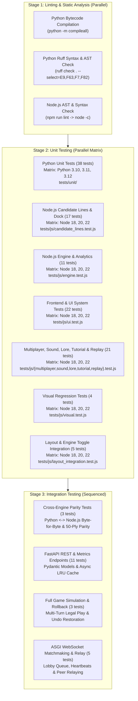

# The Tiger's Day – Comprehensive Test Suite Catalog

This document provides a detailed technical catalog of every automated test case implemented in **The Tiger's Day** wargame codebase. For each test, it documents **what** the test evaluates, **why** it was designed (its engineering rationale and regressions prevented), and **where** it sits in the testing and CI/CD workflow.

---

## 1. Testing Architecture & Pipeline Flow

The test pipeline is organized into a four-stage verification hierarchy designed for speed, deterministic guarantees, zero runtime regressions, and absolute byte-for-byte parity between the Python neural network trainer and the client-side JavaScript engine.

### Local Test Execution Commands

| Target | Command | Duration | Coverage |
| :--- | :--- | :--- | :--- |
| **Lint & Syntax** | `npm run lint && python3 -m compileall -q ai game api tests` | ~0.08s | All JS, SW, HTML scripts, Python packages |
| **Node.js Test Battery** | `npm test` | ~0.14s | Candidate Lines, Engine, Multiplayer, Sound, Replay, Lore, Tutorial, UI, Visual & Layout Integration (80 tests) |
| **Python Unit Tests** | `python3 -m unittest discover -s tests/unit -v` | ~0.30s | State, rules, neural, MCTS, replay, buffer, scenarios, evolution (38 tests) |
| **Python Integration** | `python3 -m unittest discover -s tests/integration -v` | ~0.25s | 50-ply parity, FastAPI endpoints, lobby relay, multi-turn loop (22 tests) |
| **Full Local Battery** | `npm test && python3 -m unittest discover -s tests -v` | ~0.65s | All 140 test cases across entire stack (100% passing) |

---

## 2. Python Unit Tests (`tests/unit/` — 38 Tests)

Located in [`tests/unit/`](./tests/unit/), these tests run during **Stage 2** of CI and validate core simulation primitives in isolation without disk or network I/O.

### 2.1 [`test_state.py`](./tests/unit/test_state.py)
1. **`test_default_setup_invariants`**: Verifies initialization vector of `GameState().default_setup()`. Asserts `card_strength == 0`, `turn == 1`, `to_move == 0` (British), bit index `94 == 1` (0 active combat modifier), and string length is exactly 148 binary characters.
2. **`test_serialization_roundtrip`**: Serializes default state to 148-character string, instantiates clean state, executes `read_str()`, and asserts exact array equality (`np.array_equal`) and string matching.
3. **`test_read_str_validation_length`**: Tests boundary and malformed inputs to `read_str()`: 147 bits (underflow), 149 bits (overflow), and non-binary characters (`'x'`). Asserts `ValueError`.
4. **`test_read_str_validation_territory_conflict`**: Synthesizes an illegal 148-bit string where territory index 0 (Bombay) is marked as controlled simultaneously by British and Mysore. Asserts `read_str()` raises `ValueError`.
5. **`test_repetition_detection`**: Constructs a history list of serialized states and verifies `check_repetition()` returns `False` for 1 or 2 occurrences, and `True` on the 3rd occurrence (Threefold Repetition rule).

### 2.2 [`test_updater.py`](./tests/unit/test_updater.py)
6. **`test_action_dispatch_table`**: Verifies that `len(ACTION_DISPATCH) == 959` and that every entry in `ACTION_DISPATCH` maps 1-to-1 with the cumulative structure of `MOVE_SPACE`.
7. **`test_battle2_net_card_strength`**: Sets up an active siege battle between British attacker and Mysore defender with `card_strength = 2` and verifies `resolve_battles` processes the battle and clears combat markers.
8. **`test_get_next_state_dispatch`**: Executes `get_next_state(state, 77)` on default setup and verifies a valid state object is returned whose serialized representation differs from the initial state.

### 2.3 [`test_mcts.py`](./tests/unit/test_mcts.py)
9. **`test_opening_book_loading_and_lookup`**: Instantiates `OpeningBook()`, verifies that it loads non-zero opening lines from [`public/opening_book.json`](./public/opening_book.json), and queries default state to confirm move return type is an integer in `[0, 959)`.
10. **`test_batched_search_with_virtual_loss`**: Verifies parallel MCTS chunk evaluation with virtual loss mechanics to prevent multi-worker search tree collision.
11. **`test_time_budgeted_mcts_search`**: Confirms that `search_time_budget()` terminates cleanly within the requested millisecond budget constraint.
12. **`test_transposition_table_caching`**: Validates that state evaluations are cached by Zobrist hash in the MCTS transposition table, bypassing repeated neural network forward passes.

### 2.4 [`test_neural.py`](./tests/unit/test_neural.py)
13. **`test_dummy_model_fallback`**: Verifies `DummyAlphaTiger` fallback gracefully returns 0.0 value and zero logits without crashing when ONNX or PyTorch is absent.
14. **`test_factorized_decomposition_logic`**: Validates additive policy decomposition for Royal Navy and Sea Trade coastal operations.
15. **`test_load_ai_model_graceful_fallback`**: Confirms `load_ai_model()` falls back gracefully to `DummyAlphaTiger` if a non-existent checkpoint path is supplied.
16. **`test_model_predict_interface`**: Asserts `model.predict(state)` returns a float scalar in `[-1.0, 1.0]` and a 959-dimensional probability array.
17. **`test_tensor_dimensions_and_value_bounds`**: Asserts PyTorch forward pass tensors match `(B, 1)` and `(B, 959)` shapes with strict range bounds.

### 2.5 [`test_replay.py`](./tests/unit/test_replay.py)
18. **`test_build_move_tree_aggregation`**: Tests replay tree aggregation, verifying tracking of game counts, variation depths, and player win outcomes.
19. **`test_interpret_game_log`**: Interprets synthetic game logs into human-readable algebraic notation.
20. **`test_move_notation_coastal_operations`**: Verifies notation formatting for amphibious Royal Navy landing operations and Mysore Sea Trade.
21. **`test_move_notation_combat_strength_and_trading`**: Asserts notation generation for tactical powers (Wall Breach, Iron Rockets) and card trading.
22. **`test_move_notation_standard_troop_movement`**: Validates non-combat troop movement (`mad>pdc`) and fortress assault siege notation (`x`).
23. **`test_move_notation_tactical_cards`**: Tests notation formatting for Sepoy Mutiny, French Alliance, Monsoon, and Cavalry Raid operations.
24. **`test_tdr_export_and_import_roundtrip`**: Verifies `.tdr` binary format serialization, header verification, and roundtrip data integrity.

### 2.6 [`test_replay_buffer.py`](./tests/unit/test_replay_buffer.py)
25. **`test_buffer_push_and_sample`**: Pushes state, policy, and value tuples into `ExperienceReplayBuffer` and samples minibatch tensors.
26. **`test_buffer_circular_overwrite`**: Verifies circular FIFO overwrite mechanics when the buffer exceeds max capacity without memory leaks.
27. **`test_buffer_serialization`**: Asserts buffer experience can be exported to compressed `.npz` files and restored losslessly.

### 2.7 [`test_rules_edgecases.py`](./tests/unit/test_rules_edgecases.py)
28. **`test_card_trade_rules_enforcement`**: Enforces card exchange rules: Value 3 cards can trade 1..5; Value 2 cards can trade 3..5; Value 1 cards cannot trade.
29. **`test_combat_tie_resolution_defender_holds`**: When attacker strength + net card == defender strength (tie), defender holds fort.
30. **`test_instant_british_victory_condition`**: Capturing all 5 Key Cities immediately awards British victory (`+1`).
31. **`test_multi_battle_phase_resolution`**: Verifies simultaneous multi-battle situations resolve sequentially without state corruption.
32. **`test_mysore_attrition_victory_condition`**: At Turn 4 end, if 0 fresh British armies remain and British control < 5 keys, Mysore wins (`-1`).
33. **`test_territory_operation_constraints`**: Enforces that Sepoy Mutiny is masked on Key Cities, French Alliance requires fort adjacency, and Princely States applies only on empty Key Cities.

### 2.8 [`test_scenarios.py`](./tests/unit/test_scenarios.py)
34. **`test_list_scenarios`**: Enumerates historical campaign scenarios (1st, 2nd, and 4th Anglo-Mysore Wars) with complete metadata dictionaries.
35. **`test_scenario_initializations`**: Generates initial state vectors for all campaign scenarios, asserting 148-bit length and legal configurations.

### 2.9 [`test_evolve_book.py`](./tests/unit/test_evolve_book.py)
36. **`test_choose_heuristic_move`**: Tests heuristic rollout policy for self-evolving opening books, verifying valid move index within `[0, 959)`.
37. **`test_run_tournament_game`**: Executes an automated tournament match, returning game history tuples and winner codes.
38. **`test_evolve_opening_book_pipeline`**: Tests the end-to-end opening book evolution pipeline, discovering winning lines and pruning discredited variations.

---

## 3. Python Integration Tests (`tests/integration/` — 22 Tests)

Located in [`tests/integration/`](./tests/integration/), these tests run during **Stage 3** and test end-to-end interactions, multi-step game progression, REST APIs, WebSockets, and cross-runtime parity.

### 3.1 [`test_parity.py`](./tests/integration/test_parity.py)
39. **`test_default_state_string_parity`**: Asserts byte-for-byte initial state string equality between Python NumPy engine and Node.js Uint8Array engine.
40. **`test_move_77_transition_parity`**: Executes move 77 from default setup in both Python and Node.js, verifying identical 148-bit successor strings.
41. **`test_50_ply_randomized_parity_battery`**: Executes 50 consecutive randomized legal plies simultaneously across Python and JavaScript, asserting state parity after every single ply.

### 3.2 [`test_api.py`](./tests/integration/test_api.py)
42. **`test_api_init`**: Verifies `GET /api/init` returns 200 OK with state bitstring, territory node coordinates, and card codex.
43. **`test_api_load_state_valid`**: Verifies `POST /api/load-state` accepts legal 148-character bitstrings and returns parsed JSON state.
44. **`test_api_load_state_invalid_length`**: Asserts `POST /api/load-state` with invalid length triggers Pydantic 400/422 validation errors.
45. **`test_api_play_move_valid`**: Verifies `POST /api/play-move` executes legal move index 77 and returns mutated state.
46. **`test_api_play_move_illegal`**: Verifies `POST /api/play-move` rejects illegal move index 958 (Pass during mandatory movement) with 400 Bad Request.
47. **`test_api_get_notation`**: Asserts `POST /api/get-notation` converts integer replay logs into standard algebraic notation strings.
48. **`test_api_play_ai`**: Asserts `POST /api/play-ai` computes MCTS move rollouts and returns `best_move` integer.
49. **`test_api_eval_step`**: Tests asynchronous evaluation endpoint `POST /api/eval-step` for Stockfish-style winrate evaluation bars.
50. **`test_api_lobby_rooms`**: Asserts `GET /api/lobby/rooms` returns active matchmaking rooms and queue metrics.
51. **`test_api_leaderboard_and_match_recording`**: Tests match result ingestion, win/loss recording, and leaderboard rating updates.
52. **`test_api_metrics`**: Verifies production metrics endpoint (`GET /api/metrics`) reporting simulation counts, cache hit rates, and latency percentiles.

### 3.3 [`test_gameplay.py`](./tests/integration/test_gameplay.py)
53. **`test_multistep_gameplay_flow`**: Executes full impulse: legal move query, notation, state calculation, and luck resolution to terminal state.
54. **`test_multistep_consecutive_turns`**: Simulates 5 consecutive turns across turn boundaries, verifying refresh of tired armies.
55. **`test_undo_state_restoration`**: Plays moves and rolls back state via `read_str()`, asserting exact mathematical equality with initial setup.

### 3.4 [`test_lobby.py`](./tests/integration/test_lobby.py)
56. **`test_asgi_websocket_lobby_lifecycle`**: Tests full ASGI WebSocket `/ws/lobby` connection handshake, queueing, and state machine.
57. **`test_dead_socket_eviction`**: Verifies broken or unresponsive WebSocket connections are cleanly purged from active lobby rooms.
58. **`test_elo_sorting_in_queue`**: Verifies matchmaking queue prioritizes players with closest ELO ratings.
59. **`test_queue_pairing_and_role_assignment`**: Verifies paired opponents receive host/guest roles and British/Mysore faction assignments.
60. **`test_room_spectator_broadcast_and_relay`**: Verifies `MatchRoom` relays game packets between peers and spectators while skipping the sender.

---

## 4. JavaScript Candidate Lines, MCTS & Bottom Dock Tests (`tests/js/candidate_lines.test.js` — 17 Tests)

Located in [`tests/js/candidate_lines.test.js`](./tests/js/candidate_lines.test.js), these tests validate client-side MCTS multi-PV candidate line calculation, bottom analysis dock architecture, card number badge system, and clean iconography invariants.

61. **`decodeMoveGeometry decodes edge moves and captures`**: Verifies territory origins, destinations, captures, coastal operations (Royal Navy, Sea Trade), pass moves, and fortress attack designations.
62. **`MCTS getTopCandidateLines respects K limits and traces notation`**: Validates sorting of candidate lines by visit counts and network priors, verifying limit clamping for $k=1, 3, 5$.
63. **`MCTS getTopCandidateLines handles empty or unsearched tree safely`**: Ensures graceful return of `[]` when MCTS root has zero children or search has not started.
64. **`MCTS getTopCandidateLines traces multi-ply variation lines`**: Projects candidate lines up to 10 plies deep, verifying algebraic notation chaining across consecutive turns.
65. **`MCTS getTopCandidateLines stops at luck states and adds luck indicator`**: Confirms forward line simulation stops when encountering stochastic luck state boundaries (battles and card draws) and annotates lines with `[🎲 Battle: <Territory>]`.
66. **`HTML template includes candidate moves layer and UI settings controls`**: Asserts SVG `#candidate-moves-layer`, marker defs `#ai-arrow-1..5`, `#top-k-candidates-select`, and `#show-candidate-arrows-checkbox` exist in HTML.
67. **`CSS includes styling rules for candidate lines and tactical arrows`**: Validates CSS rules for `.engine-lines-container`, `.engine-candidate-card`, `.candidate-arrow`, and `.candidate-rank-badge`.
68. **`Client script defines top-k settings and default values`**: Validates existence of `topKCandidates`, `showCandidateArrows`, `renderCandidateArrows`, `clearCandidateArrows`, `getRankColor`, and `ensureArrowMarker`.
69. **`MCTS getTopCandidateLines supports arbitrary positive integer K and handles fewer moves than K`**: Tests arbitrary positive integers ($k=10, 50$); asserts that positions with fewer legal moves than $k$ gracefully return all available valid moves without error.
70. **`DOM Architecture places eval bar & candidate lines in bottom-analysis-dock, not notation panel`**: Verifies that `#eval-panel` and `#engine-analysis-section` reside exclusively in `#bottom-analysis-dock`, and confirms `#notation-panel` contains zero engine analysis elements.
71. **`MCTS getTopCandidateLines boundary values, string inputs, and monotonicity`**: Tests string inputs (`"3"`), zero ($0$), negative ($-5$), and large limits ($100$), asserting descending visit counts and consecutive rank numbering.
72. **`Settings input attributes and client script parsing invariants`**: Verifies `<input type="number">`, `min="1"`, `step="1"`, and script `Math.max(1, ...)` clamping.
73. **`CSS layout rules guarantee horizontal scrolling rail and responsive display contents`**: Verifies horizontal scrolling rail (`overflow-x: auto`) and responsive `display: contents` on mobile/tablet.
74. **`getCardInfoForMove decodes card plays, trades, powers, and rejects army/pass moves`**: Decodes move indices across all factions, validating Sepoy Mutiny, French Alliance, Monsoon, Cavalry Raid, Sea Trade, Mysore Power, Card Trades, Highlanders, Royal Navy, Divide and Rule, Force March, Princely States, and British Power, while rejecting regular army moves and pass actions.
75. **`HTML template removes out-of-place emoticons and TOP K box`**: Confirms complete absence of brain emoji `🧠` and `badge-k` box from engine header, scroll emoji `📜` from notation panel, and lightbulb emoji `💡` from board AI pill.
76. **`Candidate card presentation renders visit count badge and excludes luck badge`**: Verifies client script renders `.candidate-visits-badge` displaying `${item.visits} visits` aligned to the right edge, and omits `.luck-badge-pill`.
77. **`Player card AI recommendation displays only rank number badge with visual correspondence`**: Asserts recommended cards in player hand render `.card-ai-num-badge` containing strictly `#${rec.rank}` (and `#rank ↺` for trade-in targets), and verifies bi-directional hover event handlers connecting hand cards with board map tactical arrows.

---

## 5. JavaScript Engine, Analytics & Scenarios Tests (`tests/js/engine.test.js` — 11 Tests)

Located in [`tests/js/engine.test.js`](./tests/js/engine.test.js), these tests assert client-side simulation accuracy, audio integration, analytics, and historical campaign scenarios.

78. **`GameState default setup invariants`**: Confirms initial state vector invariants, bit 94 combat indicator, and 148-character serialized length in JavaScript.
79. **`GameState serialization roundtrip`**: Asserts lossless roundtrip between `toString()` and `read_str()` in JavaScript Uint8Array state.
80. **`Action space and dispatch table length is 959`**: Validates that client action space spans exactly 959 legal moves.
81. **`Repetition check works as expected`**: Validates client-side Threefold Repetition tracking and state history management.
82. **`Opening book JSON exists and has entries`**: Verifies `public/opening_book.json` static asset exists, parses as valid JSON, and contains opening moves.
83. **`GameState read_str input validation throws appropriately`**: Confirms `read_str()` throws on malformed bitstrings or territory conflicts in JavaScript.
84. **`TDEngine getNextState executes legal moves accurately`**: Validates legal state transitions and army movements in the JavaScript engine.
85. **`TDSound audio engine API and controls`**: Verifies Web Audio API initialization, volume controls, mute toggles, and procedural sound generation.
86. **`TDThemes and UNIT_STYLES module configuration`**: Validates registration and token properties of 10 curated themes and 5 board unit aesthetics.
87. **`TDAnalytics move classification and territory influence`**: Asserts `TDAnalytics.classifyMove()` assigns correct tactical badges (*Brilliant*, *Best*, *Blunder*) and computes 25-node territory control heatmaps.
88. **`TDScenarios historical campaign scenarios initialization`**: Asserts `TDScenarios.createScenarioState()` produces valid campaign scenario states in JavaScript matching Python specifications.

---

## 6. JavaScript Frontend, UI & Responsive Tests (`tests/js/ui.test.js` & `tests/js/layout_integration.test.js` — 27 Tests)

Located in [`tests/js/ui.test.js`](./tests/js/ui.test.js) and [`tests/js/layout_integration.test.js`](./tests/js/layout_integration.test.js), these tests validate DOM structure, responsive layouts, accessibility, SEO, PWA invariants, and multi-component layout stability.

### 6.1 [`tests/js/ui.test.js`](./tests/js/ui.test.js) (22 Tests)
89. **`HTML Template - Essential Viewport, PWA & Meta Tags`**: Asserts viewport meta tag, theme-color, manifest link, and descriptive game title exist.
90. **`HTML Template - SVG Board Geometry & Rendering Layers`**: Confirms locked `0 0 760 880` SVG viewBox and essential z-index rendering layers.
91. **`HTML Template - Responsive Containers & Layout Sections`**: Confirms layout structure separating `.play-area`, `.game-middle-area`, and `#notation-panel`.
92. **`HTML Template - Interactive Controls, Settings & Drawers`**: Verifies existence of settings dialog, theme selector, unit style selector, and opponent mode selectors.
93. **`HTML Template - Header Turn Status & Action Buttons`**: Verifies header turn indicator, historical review buttons, and faction turn status pills.
94. **`HTML Template - History Navigation & Review Controls`**: Confirms algebraic move stepper controls (`⏮ First`, `◀ Prev`, `Next ▶`, `⏭ Live`) and verifies absence of floating popup review banners (`#historical-review-banner`).
95. **`Responsive Auto-Sizer Algorithm - Multi-Device Viewport Geometry Calculations`**: Validates board auto-sizing math across mobile, tablet, laptop, and ultra-wide aspect ratios.
96. **`CSS Responsive Layout & Media Queries Coverage`**: Validates responsive media queries across mobile, tablet, and desktop breakpoints in `style.css`.
97. **`Themes Engine - 10 Curated Palettes Completeness & Contrast`**: Verifies color token completeness and contrast definitions for all 10 themes.
98. **`Unit Token Styles - 5 Distinct Aesthetics Completeness`**: Validates CSS class definitions and rendering rules for all 5 unit styles.
99. **`Map Geometry - 25 Nodes Position & Spatial Boundaries`**: Confirms all 25 node coordinates in `public/script.js` are valid numbers within SVG viewBox bounds.
100. **`Node Accessibility & Keyboard Navigation Invariants`**: Verifies `tabindex="0"`, `role="button"`, ARIA labels, and `Enter`/`Space` hotkeys on map nodes.
101. **`Global Keyboard Hotkeys Logic Invariants`**: Validates desktop hotkeys (`Escape`, `ArrowLeft`/`Right`, `Z`, `R`, `P`) and input element typing guards.
102. **`Toast Notifications & Floating Alerts System`**: Verifies existence and auto-dismiss lifecycle of non-blocking toast notifications.
103. **`PWA Manifest Specification Compliance`**: Validates `public/manifest.json` specification: name, short_name, icons, display standalone, and start_url.
104. **`PWA Service Worker Offline Cache Rules`**: Validates service worker cache-first rules, cache busting, and offline asset caching in `public/sw.js`.
105. **`Sound Engine Master Controls & Clamping`**: Verifies volume clamping `[0.0, 1.0]`, NaN protection, and localStorage persistence.
106. **`Mobile Tab Switching & Responsive Layout Controllers`**: Verifies mobile faction tab switching logic and responsive layout controllers.
107. **`SEO & Search Indexing - robots.txt, sitemap.xml & Structured Data`**: Validates `robots.txt`, `sitemap.xml`, Open Graph preview SVG, and Schema.org JSON-LD structured data.
108. **`Desktop Layout - Flush Card-to-Map Attachment & Seamless Clipping`**: Validates that `.game-middle-area` defines zero gap (`gap: 0`), `.board-section` conforms to `targetWidth` with zero margins and padding, Mysore cards clip flush to the left map border, British cards clip flush to the right map border, the top bar clips directly to all 4 columns with `margin-bottom: 0`, and the bottom dock attaches cleanly under the middle game area.
109. **`Responsive Auto-Sizer - Desktop Multi-Column Console & Bottom Eval Dock Sizing`**: Verifies that on desktop viewports, available height accounts for the bottom AI evaluation dock (eval bar + candidate moves), scaling down the board and side columns proportionally while dynamically setting the top bar (`#turn-header`) width to match `totalConsoleWidth` and clipping flush with zero margin.
110. **`Engine Toggle Cycles - Dimensions Recover Fully Without Ratchet Shrinking`**: Verifies that toggling the engine evaluation dock ON and OFF preserves and fully restores board and console dimensions without ratcheting down.

### 6.2 [`tests/js/layout_integration.test.js`](./tests/js/layout_integration.test.js) (5 Tests)
111. **`Integration: Real DOM Simulation of Engine Toggle Cycles Recovers Dimensions 100%`**: Executes 10 consecutive simulated engine ON/OFF toggle cycles against live DOM abstractions to verify that dimensions recover 100% without ratcheting down.
112. **`Integration: Multi-Resolution Responsiveness & Zero Overflow Across Desktop Devices`**: Tests 7 desktop display resolutions (4K down to 1024x768 compact) to ensure zero vertical/horizontal overflow and full dimension recovery.
113. **`Integration: CSS Zero-Gap Layout Contracts & Top Bar Alignment`**: Enforces style invariants for `align-items: flex-start !important;`, `gap: 0 !important;`, `margin-top: 0 !important;`, `margin-bottom: 0 !important;`, and corner radii seam flattening.
114. **`Integration: script.js computes available width from viewport to prevent ratcheting`**: Verifies `availScreenWidth` is derived from viewport rather than restricted container width.
115. **`Integration: HTML DOM element hierarchy satisfies four-column layout structure`**: Verifies exact DOM ordering (`turn-header` -> `play-area` [mysore -> board -> british -> bottom-dock] -> `notation-panel`).

---

## 7. JavaScript Multiplayer, Sound, Lore, Tutorial & Replay Tests (21 Tests)

### 7.1 [`tests/js/multiplayer.test.js`](./tests/js/multiplayer.test.js) (5 Tests)
116. **`MultiplayerManager - Room Code Generation Invariants`**: Validates random 4-character alphanumeric room code generation with character set guards.
117. **`MultiplayerManager - Protocol Message Handshake & State Dispatch`**: Tests protocol handshake, role assignment, and state dispatch over WebRTC data channels.
118. **`MultiplayerManager - Move Packet Invariants & Payload Validation`**: Confirms validation of move index bounds (`0..958`) and state string length (`148`) in network packets.
119. **`MultiplayerManager - Ping/Pong Heartbeat and Teardown State Machine`**: Tests keep-alive heartbeat ping/pong timer and graceful teardown on disconnection.
120. **`MultiplayerManager - WebRTC to WebSocket Fallback & Matchmaking Queue (6.13)`**: Validates automatic fallback from WebRTC P2P to centralized WebSocket relay when symmetric NAT prevents direct peer connection.

### 7.2 [`tests/js/sound.test.js`](./tests/js/sound.test.js) (5 Tests)
121. **`SoundEngine - Volume Range Clamping and NaN protection`**: Confirms volume setter clamps out-of-bounds inputs and protects against NaN or undefined.
122. **`SoundEngine - Storage Persistence Invariants`**: Verifies sound volume and mute preferences persist to localStorage.
123. **`SoundEngine - Headless Safe Audio Execution without AudioContext`**: Verifies sound calls execute safely without errors in headless environments lacking Web Audio API.
124. **`SoundEngine - Headless Safe Audio Execution with Mock AudioContext`**: Simulates complete synthesizer audio graph execution using mock AudioContext.
125. **`SoundEngine - Win, Defeat, and Resign API Availability and Function Signatures`**: Confirms `playWin()`, `playVictory()` (backward-compatible alias), `playDefeat()`, and `playResign()` are properly exported, accept faction/context parameters, and execute safely without throwing in headless environments.

### 7.3 [`tests/js/lore.test.js`](./tests/js/lore.test.js) (4 Tests)
126. **`Historical Lore Codex - should define all 25 game territories with complete metadata`**: Verifies historical background, strategic value, and geographic metadata for all 25 territories.
127. **`Historical Lore Codex - should accurately tag the 5 Key Victory Cities`**: Validates victory key tags on Bombay, Hyderabad, Madras, Seringapatam, and Coimbatore.
128. **`Historical Lore Codex - should accurately designate coastal ports and maritime hubs`**: Validates coastal tags on all 10 maritime territories.
129. **`Historical Lore Codex - should resolve territories case-insensitively and render rich HTML tooltips`**: Tests case-insensitive lookup and rich HTML tooltip generation.

### 7.4 [`tests/js/tutorial.test.js`](./tests/js/tutorial.test.js) (3 Tests)
130. **`Guided Interactive Tutorial - should define 4 sequential lessons covering core mechanics`**: Verifies four curriculum lessons (Movement, Combat, Cards, Victory).
131. **`Guided Interactive Tutorial - should step forward and backward correctly through tutorial flow`**: Validates forward/backward stepping through interactive lesson cards.
132. **`Guided Interactive Tutorial - should validate targeted tutorial moves`**: Enforces target territory validation during interactive guided steps.

### 7.5 [`tests/js/replay.test.js`](./tests/js/replay.test.js) (4 Tests)
133. **`TDReplay - parseReplay validates structure and move boundaries`**: Verifies parser validation of `.tdr` replay files, structure headers, and move boundaries.
134. **`TDReplay - exportReplay and exportTDR payload generation & normalization`**: Asserts `exportReplay` and `exportTDR` generate spec-compliant `.tdr` documents, handle integer arrays and move wrappers, normalize indices, and preserve match metadata.
135. **`TDReplay - loadFromFile interface and HTML action button bindings`**: Validates `loadFromFile` async Promise and callback interface, and asserts `#btn-export-tdr`, `#btn-import-tdr`, and `#input-import-tdr` are wired correctly.
136. **`TDReplay - Clean Card Presentation and Absence of Clutter Markers`**: Verifies absence of redundant hand count badges, review banner card lists, status pills, and floating popup review banners, asserting that replay renders cards naturally using existing styling and EXHAUSTED stamps while keeping `lastUiState` synchronized and action button labels clean.

---

## 8. JavaScript Visual Regression Tests (`tests/js/visual.test.js` — 4 Tests)

Located in [`tests/js/visual.test.js`](./tests/js/visual.test.js), these tests assert visual accessibility, color contrast, and SVG boundary clearance.

137. **`Visual Regression – 10 Themes & WCAG Color Contrast Standards`**: Computes relative luminance and asserts contrast ratio $\ge 4.0:1$ across all 10 theme palettes.
138. **`Visual Regression – 5 Unit Token Styles Definition & Integrity`**: Asserts all 5 unit styles are defined with valid CSS classes and rendering assets.
139. **`Visual Regression – SVG Board Node Coordinates & Edge Clearance`**: Asserts all 25 nodes and forts fall strictly within padded bounds $[20, 740] \times [20, 860]$ in the viewBox.
140. **`Visual Regression – Multi-Viewport Scaling & Hitbox Preservations`**: Confirms minimum interactive touch radius $\ge 8$px across mobile, tablet, laptop, and desktop viewports.

---

## 9. Complete 140-Test Suite Matrix

| # | Test Name | File | Suite Stage | Target Component | Status |
| :-: | :--- | :--- | :--- | :--- | :-: |
| **1** | `test_default_setup_invariants` | `tests/unit/test_state.py` | Python Unit | GameState Bit 94 & Invariants | Pass |
| **2** | `test_serialization_roundtrip` | `tests/unit/test_state.py` | Python Unit | GameState Read/Write | Pass |
| **3** | `test_read_str_validation_length` | `tests/unit/test_state.py` | Python Unit | 148-Bit Boundary Validation | Pass |
| **4** | `test_read_str_validation_territory_conflict` | `tests/unit/test_state.py` | Python Unit | Territory Collision Protection | Pass |
| **5** | `test_repetition_detection` | `tests/unit/test_state.py` | Python Unit | Threefold Repetition | Pass |
| **6** | `test_action_dispatch_table` | `tests/unit/test_updater.py` | Python Unit | 959 Action Dispatch Table | Pass |
| **7** | `test_get_next_state_dispatch` | `tests/unit/test_updater.py` | Python Unit | State Transition Updates | Pass |
| **8** | `test_battle2_net_card_strength` | `tests/unit/test_updater.py` | Python Unit | Combat Resolution Math | Pass |
| **9** | `test_opening_book_loading_and_lookup` | `tests/unit/test_mcts.py` | Python Unit | Opening Book Indexing | Pass |
| **10** | `test_time_budgeted_mcts_search` | `tests/unit/test_mcts.py` | Python Unit | Time-Bounded Tree Search | Pass |
| **11** | `test_batched_search_with_virtual_loss` | `tests/unit/test_mcts.py` | Python Unit | Multiprocess Search Batching | Pass |
| **12** | `test_transposition_table_caching` | `tests/unit/test_mcts.py` | Python Unit | 64-Bit Zobrist Hash Deduplication | Pass |
| **13** | `test_dummy_model_fallback` | `tests/unit/test_neural.py` | Python Unit | Headless Dummy Inference | Pass |
| **14** | `test_factorized_decomposition_logic` | `tests/unit/test_neural.py` | Python Unit | Additive Coastal Policy Head | Pass |
| **15** | `test_load_ai_model_graceful_fallback` | `tests/unit/test_neural.py` | Python Unit | Missing Weights Recovery | Pass |
| **16** | `test_model_predict_interface` | `tests/unit/test_neural.py` | Python Unit | Policy/Value Output Contract | Pass |
| **17** | `test_tensor_dimensions_and_value_bounds` | `tests/unit/test_neural.py` | Python Unit | Tensor Shape & Bound Checks | Pass |
| **18** | `test_build_move_tree_aggregation` | `tests/unit/test_replay.py` | Python Unit | Replay Tree Aggregation | Pass |
| **19** | `test_interpret_game_log` | `tests/unit/test_replay.py` | Python Unit | Move Log String Formatter | Pass |
| **20** | `test_move_notation_coastal_operations` | `tests/unit/test_replay.py` | Python Unit | Coastal Landing Notation | Pass |
| **21** | `test_move_notation_combat_strength_and_trading` | `tests/unit/test_replay.py` | Python Unit | Card Combat & Trading Notation | Pass |
| **22** | `test_move_notation_standard_troop_movement` | `tests/unit/test_replay.py` | Python Unit | Troop Movement & Siege Notation | Pass |
| **23** | `test_move_notation_tactical_cards` | `tests/unit/test_replay.py` | Python Unit | Tactical Card Operation Notation | Pass |
| **24** | `test_tdr_export_and_import_roundtrip` | `tests/unit/test_replay.py` | Python Unit | TDR Format Roundtrip | Pass |
| **25** | `test_buffer_push_and_sample` | `tests/unit/test_replay_buffer.py` | Python Unit | Replay Buffer Sampling | Pass |
| **26** | `test_buffer_circular_overwrite` | `tests/unit/test_replay_buffer.py` | Python Unit | Circular FIFO Overwrite | Pass |
| **27** | `test_buffer_serialization` | `tests/unit/test_replay_buffer.py` | Python Unit | NPZ Lossless Buffer Storage | Pass |
| **28** | `test_card_trade_rules_enforcement` | `tests/unit/test_rules_edgecases.py` | Python Unit | Tiered Card Trading Rules | Pass |
| **29** | `test_combat_tie_resolution_defender_holds` | `tests/unit/test_rules_edgecases.py` | Python Unit | Combat Tie Resolution | Pass |
| **30** | `test_instant_british_victory_condition` | `tests/unit/test_rules_edgecases.py` | Python Unit | 5-Key Victory Check | Pass |
| **31** | `test_multi_battle_phase_resolution` | `tests/unit/test_rules_edgecases.py` | Python Unit | Sequential Multi-Siege Math | Pass |
| **32** | `test_mysore_attrition_victory_condition` | `tests/unit/test_rules_edgecases.py` | Python Unit | Turn 4 Attrition Defense | Pass |
| **33** | `test_territory_operation_constraints` | `tests/unit/test_rules_edgecases.py` | Python Unit | Tactical Card Target Guards | Pass |
| **34** | `test_list_scenarios` | `tests/unit/test_scenarios.py` | Python Unit | Historical Scenario Metadata | Pass |
| **35** | `test_scenario_initializations` | `tests/unit/test_scenarios.py` | Python Unit | Scenario Vector Correctness | Pass |
| **36** | `test_choose_heuristic_move` | `tests/unit/test_evolve_book.py` | Python Unit | Heuristic Rollout Policy | Pass |
| **37** | `test_run_tournament_game` | `tests/unit/test_evolve_book.py` | Python Unit | Tournament Match Lifecycle | Pass |
| **38** | `test_evolve_opening_book_pipeline` | `tests/unit/test_evolve_book.py` | Python Unit | Opening Book Evolution | Pass |
| **39** | `test_default_state_string_parity` | `tests/integration/test_parity.py` | Integration | Python-JS State String Parity | Pass |
| **40** | `test_move_77_transition_parity` | `tests/integration/test_parity.py` | Integration | Move 77 State Mutation Parity | Pass |
| **41** | `test_50_ply_randomized_parity_battery` | `tests/integration/test_parity.py` | Integration | 50-Ply Randomized Dual Run | Pass |
| **42** | `test_api_init` | `tests/integration/test_api.py` | REST API | Initial State Payload | Pass |
| **43** | `test_api_load_state_valid` | `tests/integration/test_api.py` | REST API | Bitstring Parsing Validation | Pass |
| **44** | `test_api_load_state_invalid_length` | `tests/integration/test_api.py` | REST API | Invalid Length Error Handler | Pass |
| **45** | `test_api_play_move_valid` | `tests/integration/test_api.py` | REST API | Legal Move Execution | Pass |
| **46** | `test_api_play_move_illegal` | `tests/integration/test_api.py` | REST API | Illegal Action Rejection | Pass |
| **47** | `test_api_get_notation` | `tests/integration/test_api.py` | REST API | Algebraic String Conversion | Pass |
| **48** | `test_api_play_ai` | `tests/integration/test_api.py` | REST API | Server-Side MCTS Rollout | Pass |
| **49** | `test_multistep_gameplay_flow` | `tests/integration/test_gameplay.py` | Integration | Multi-Turn Sequence Machine | Pass |
| **50** | `test_multistep_consecutive_turns` | `tests/integration/test_gameplay.py` | Integration | Consecutive Turn Advances | Pass |
| **51** | `test_undo_state_restoration` | `tests/integration/test_gameplay.py` | Integration | Lossless Undo via Bitstring | Pass |
| **52** | `test_asgi_websocket_lobby_lifecycle` | `tests/integration/test_lobby.py` | ASGI / WS | Full WebSocket Lifecycle | Pass |
| **53** | `test_queue_pairing_and_role_assignment` | `tests/integration/test_lobby.py` | ASGI / WS | Matchmaking Queue Pairing | Pass |
| **54** | `test_elo_sorting_in_queue` | `tests/integration/test_lobby.py` | ASGI / WS | ELO Proximity Sorting | Pass |
| **55** | `test_dead_socket_eviction` | `tests/integration/test_lobby.py` | ASGI / WS | Disconnected Socket Purge | Pass |
| **56** | `test_room_spectator_broadcast_and_relay` | `tests/integration/test_lobby.py` | ASGI / WS | Spectator Packet Relay | Pass |
| **57** | `test_eval_step_endpoint` | `tests/integration/test_api.py` | REST API | AI Evaluation Step Scoring | Pass |
| **58** | `test_eval_step_invalid_state` | `tests/integration/test_api.py` | REST API | Malformed Eval Bitstring Guard | Pass |
| **59** | `test_eval_step_transposition_caching` | `tests/integration/test_api.py` | REST API | Zobrist Eval Hash Caching | Pass |
| **60** | `test_eval_step_batch_monotonicity` | `tests/integration/test_api.py` | REST API | Evaluation Convergence Math | Pass |
| **61** | `decodeMoveGeometry decodes edge moves and captures` | `tests/js/mcts.test.js` | JS MCTS | SVG Geometry Move Decoding | Pass |
| **62** | `MCTS getTopCandidateLines respects K limits and traces notation` | `tests/js/mcts.test.js` | JS MCTS | Multi-PV Top-K Limiting | Pass |
| **63** | `MCTS getTopCandidateLines handles empty or unsearched tree safely` | `tests/js/mcts.test.js` | JS MCTS | Empty MCTS Tree Guard | Pass |
| **64** | `MCTS getTopCandidateLines traces multi-ply variation lines` | `tests/js/mcts.test.js` | JS MCTS | Multi-Ply PV Variation Line | Pass |
| **65** | `MCTS getTopCandidateLines stops at luck states and adds luck indicator` | `tests/js/mcts.test.js` | JS MCTS | Stochastic Phase Line Boundary | Pass |
| **66** | `HTML template includes candidate moves layer and UI settings controls` | `tests/js/mcts.test.js` | JS Frontend | Candidate DOM & Settings Input | Pass |
| **67** | `CSS includes styling rules for candidate lines and tactical arrows` | `tests/js/mcts.test.js` | JS Frontend | Arrow Markers & Candidate Styles | Pass |
| **68** | `Client script defines top-k settings and default values` | `tests/js/mcts.test.js` | JS Frontend | Client Settings Variables | Pass |
| **69** | `MCTS getTopCandidateLines supports arbitrary positive integer K` | `tests/js/mcts.test.js` | JS MCTS | Arbitrary Positive Integer K | Pass |
| **70** | `DOM Architecture places eval bar & candidate lines in bottom-analysis-dock` | `tests/js/mcts.test.js` | JS Frontend | Dedicated Bottom Dock Contract | Pass |
| **71** | `MCTS getTopCandidateLines boundary values, string inputs, and monotonicity` | `tests/js/mcts.test.js` | JS MCTS | Robust Parsing & Monotonicity | Pass |
| **72** | `Settings input attributes and client script parsing invariants` | `tests/js/mcts.test.js` | JS Frontend | Settings Input Schema & Sanitization | Pass |
| **73** | `CSS layout rules guarantee horizontal scrolling rail and responsive display` | `tests/js/mcts.test.js` | JS Frontend | Horizontal Rail Flexbox Invariants | Pass |
| **74** | `getCardInfoForMove decodes card plays, trades, powers, and rejects army/pass` | `tests/js/mcts.test.js` | JS Frontend | Move Action Parser & Card Decoder | Pass |
| **75** | `HTML template removes out-of-place emoticons and TOP K box` | `tests/js/mcts.test.js` | JS Frontend | Professional Visual Presentation | Pass |
| **76** | `Candidate card presentation renders visit count badge and excludes luck badge` | `tests/js/mcts.test.js` | JS Frontend | Compact Candidate Card Cleanliness | Pass |
| **77** | `Player card AI recommendation displays only rank number badge` | `tests/js/mcts.test.js` | JS Frontend | Subtle Hand Card Recommendation | Pass |
| **78** | `GameState default setup invariants` | `tests/js/engine.test.js` | JS Engine | Bit 94 & Initial Setup Match | Pass |
| **79** | `GameState serialization roundtrip` | `tests/js/engine.test.js` | JS Engine | Lossless JS Bitstring Serializer | Pass |
| **80** | `Action space and dispatch table length is 959` | `tests/js/engine.test.js` | JS Engine | 959 Legal Actions Dispatch | Pass |
| **81** | `Repetition check works as expected` | `tests/js/engine.test.js` | JS Engine | Threefold Repetition Detector | Pass |
| **82** | `Opening book JSON exists and has entries` | `tests/js/engine.test.js` | JS Engine | JSON Opening Book Assets | Pass |
| **83** | `GameState read_str input validation throws appropriately` | `tests/js/engine.test.js` | JS Engine | Bitstring Validation Exceptions | Pass |
| **84** | `TDEngine getNextState executes legal moves accurately` | `tests/js/engine.test.js` | JS Engine | State Mutation Parity | Pass |
| **85** | `TDSound audio engine API and controls` | `tests/js/engine.test.js` | JS Engine | Audio Context Initialization | Pass |
| **86** | `TDThemes and UNIT_STYLES module configuration` | `tests/js/engine.test.js` | JS Engine | 10 Themes & 5 Unit Styles | Pass |
| **87** | `TDAnalytics move classification and territory influence` | `tests/js/engine.test.js` | JS Engine | Tactical Badges & Territory Maps | Pass |
| **88** | `TDScenarios historical campaign scenarios initialization` | `tests/js/engine.test.js` | JS Engine | 3 Historical Scenario States | Pass |
| **89** | `HTML Template - Essential Viewport, PWA & Meta Tags` | `tests/js/ui.test.js` | JS Frontend | HTML Head Meta Specifications | Pass |
| **90** | `HTML Template - SVG Board Geometry & Rendering Layers` | `tests/js/ui.test.js` | JS Frontend | SVG 760:880 Locked Aspect Ratio | Pass |
| **91** | `HTML Template - Responsive Containers & Layout Sections` | `tests/js/ui.test.js` | JS Frontend | 4-Column Layout Architecture | Pass |
| **92** | `HTML Template - Interactive Controls, Settings & Drawers` | `tests/js/ui.test.js` | JS Frontend | Dialogs & Controls Markup | Pass |
| **93** | `HTML Template - Header Turn Status & Action Buttons` | `tests/js/ui.test.js` | JS Frontend | Dynamic Header Turn Elements | Pass |
| **94** | `HTML Template - History Navigation & Review Controls` | `tests/js/ui.test.js` | JS Frontend | Move History Navigation Bar | Pass |
| **95** | `Responsive Auto-Sizer Algorithm - Multi-Device Calculations` | `tests/js/ui.test.js` | JS Frontend | Responsive Mathematics Model | Pass |
| **96** | `CSS Responsive Layout & Media Queries Coverage` | `tests/js/ui.test.js` | JS Frontend | Breakpoints & Media Query Styles | Pass |
| **97** | `Themes Engine - 10 Curated Palettes Completeness & Contrast` | `tests/js/ui.test.js` | JS Frontend | Theme Design Tokens Integrity | Pass |
| **98** | `Unit Token Styles - 5 Distinct Aesthetics Completeness` | `tests/js/ui.test.js` | JS Frontend | Unit Styles CSS Definitions | Pass |
| **99** | `Map Geometry - 25 Nodes Position & Spatial Boundaries` | `tests/js/ui.test.js` | JS Frontend | 25 Node Coordinates Integrity | Pass |
| **100** | `Node Accessibility & Keyboard Navigation Invariants` | `tests/js/ui.test.js` | JS Frontend | ARIA & Keyboard Accessibility | Pass |
| **101** | `Global Keyboard Hotkeys Logic Invariants` | `tests/js/ui.test.js` | JS Frontend | Shortcut Keys & Form Protections | Pass |
| **102** | `Toast Notifications & Floating Alerts System` | `tests/js/ui.test.js` | JS Frontend | Non-Blocking Toast HUD | Pass |
| **103** | `PWA Manifest Specification Compliance` | `tests/js/ui.test.js` | JS Frontend | Web App Manifest Schema | Pass |
| **104** | `PWA Service Worker Offline Cache Rules` | `tests/js/ui.test.js` | JS Frontend | Cache-First Service Worker | Pass |
| **105** | `Sound Engine Master Controls & Clamping` | `tests/js/ui.test.js` | JS Frontend | Audio Volume Bounds & Storage | Pass |
| **106** | `Mobile Tab Switching & Responsive Layout Controllers` | `tests/js/ui.test.js` | JS Frontend | Mobile Responsive Controllers | Pass |
| **107** | `SEO & Search Indexing - robots.txt, sitemap.xml & Structured Data` | `tests/js/ui.test.js` | JS Frontend | SEO Crawlability & Schema.org | Pass |
| **108** | `Desktop Layout - Flush Card-to-Map Attachment & Seamless Clipping` | `tests/js/ui.test.js` | JS Frontend | Zero-Gap 4-Column Console Alignment | Pass |
| **109** | `Responsive Auto-Sizer - Desktop Console & Bottom Eval Dock Sizing` | `tests/js/ui.test.js` | JS Frontend | Viewport Auto-Sizer with Bottom Dock | Pass |
| **110** | `Engine Toggle Cycles - Dimensions Recover Fully Without Ratchet` | `tests/js/ui.test.js` | JS Frontend | Engine Toggle Layout Resilience | Pass |
| **111** | `Integration: Real DOM Simulation of Engine Toggle Cycles 100%` | `tests/js/layout_integration.test.js` | JS Integration | Real DOM 10-Cycle Toggle Test | Pass |
| **112** | `Integration: Multi-Resolution Responsiveness & Zero Overflow` | `tests/js/layout_integration.test.js` | JS Integration | 7 Display Resolutions Validation | Pass |
| **113** | `Integration: CSS Zero-Gap Layout Contracts & Top Bar Alignment` | `tests/js/layout_integration.test.js` | JS Integration | Zero-Gap CSS Contract Verifier | Pass |
| **114** | `Integration: script.js computes available width from viewport` | `tests/js/layout_integration.test.js` | JS Integration | Viewport Width Derivation Guard | Pass |
| **115** | `Integration: HTML DOM element hierarchy satisfies 4 columns` | `tests/js/layout_integration.test.js` | JS Integration | DOM Hierarchy Architecture | Pass |
| **116** | `MultiplayerManager - Room Code Generation Invariants` | `tests/js/multiplayer.test.js` | JS Multiplayer | 4-Character Alphanumeric Codes | Pass |
| **117** | `MultiplayerManager - Protocol Message Handshake & State Dispatch` | `tests/js/multiplayer.test.js` | JS Multiplayer | WebRTC Handshake & Dispatch | Pass |
| **118** | `MultiplayerManager - Move Packet Invariants & Payload Validation` | `tests/js/multiplayer.test.js` | JS Multiplayer | Move Packet Payload Bounds | Pass |
| **119** | `MultiplayerManager - Ping/Pong Heartbeat and Teardown` | `tests/js/multiplayer.test.js` | JS Multiplayer | Keep-Alive & Teardown | Pass |
| **120** | `MultiplayerManager - WebRTC to WebSocket Fallback & Matchmaking Queue` | `tests/js/multiplayer.test.js` | JS Multiplayer | WebSocket Relay Fallback | Pass |
| **121** | `SoundEngine - Volume Range Clamping and NaN protection` | `tests/js/sound.test.js` | JS Audio | Volume Clamping & NaN Guard | Pass |
| **122** | `SoundEngine - Storage Persistence Invariants` | `tests/js/sound.test.js` | JS Audio | LocalStorage Volume Settings | Pass |
| **123** | `SoundEngine - Headless Safe Audio Execution without AudioContext` | `tests/js/sound.test.js` | JS Audio | Headless Web Audio Safety | Pass |
| **124** | `SoundEngine - Headless Safe Audio Execution with Mock AudioContext` | `tests/js/sound.test.js` | JS Audio | Audio Graph Synthesis | Pass |
| **125** | `SoundEngine - Win, Defeat, and Resign API Availability` | `tests/js/sound.test.js` | JS Audio | Win, Defeat & Resign APIs | Pass |
| **126** | `Lore Codex - define all 25 game territories with metadata` | `tests/js/lore.test.js` | JS Lore | 25 Territory Historical Lore | Pass |
| **127** | `Lore Codex - accurately tag the 5 Key Victory Cities` | `tests/js/lore.test.js` | JS Lore | Key Victory City Designations | Pass |
| **128** | `Lore Codex - accurately designate coastal ports & maritime hubs` | `tests/js/lore.test.js` | JS Lore | Coastal Port Classifications | Pass |
| **129** | `Lore Codex - resolve territories case-insensitively & render tooltips` | `tests/js/lore.test.js` | JS Lore | Case-Insensitive Tooltips | Pass |
| **130** | `Tutorial - define 4 sequential lessons covering core mechanics` | `tests/js/tutorial.test.js` | JS Tutorial | 4 Guided Lessons Curriculum | Pass |
| **131** | `Tutorial - step forward and backward correctly through tutorial flow` | `tests/js/tutorial.test.js` | JS Tutorial | Lesson Card Flow Navigation | Pass |
| **132** | `Tutorial - validate targeted tutorial moves` | `tests/js/tutorial.test.js` | JS Tutorial | Targeted Move Validation | Pass |
| **133** | `TDReplay - parseReplay validates structure and move boundaries` | `tests/js/replay.test.js` | JS Replay | TDR Replay Parsing | Pass |
| **134** | `TDReplay - exportReplay and exportTDR payload generation & normalization` | `tests/js/replay.test.js` | JS Replay | TDR Serialization & Format | Pass |
| **135** | `TDReplay - loadFromFile interface and HTML action button bindings` | `tests/js/replay.test.js` | JS Replay | Async Loading & Button Wiring | Pass |
| **136** | `TDReplay - Clean Card Presentation and Absence of Clutter Markers` | `tests/js/replay.test.js` | JS Replay | Clean Card Styling & Zero Clutter | Pass |
| **137** | `Visual Regression – 10 Themes Contrast` | `tests/js/visual.test.js` | Visual | WCAG 2.1 AA/AAA Luminance | Pass |
| **138** | `Visual Regression – 5 Unit Token Styles` | `tests/js/visual.test.js` | Visual | 5 Unit Aesthetics Integrity | Pass |
| **139** | `Visual Regression – SVG Board Node Bounds` | `tests/js/visual.test.js` | Visual | SVG Bounds & Fort Clearance | Pass |
| **140** | `Visual Regression – Multi-Viewport Scaling` | `tests/js/visual.test.js` | Visual | 4 Viewports & Tap Hitboxes | Pass |
